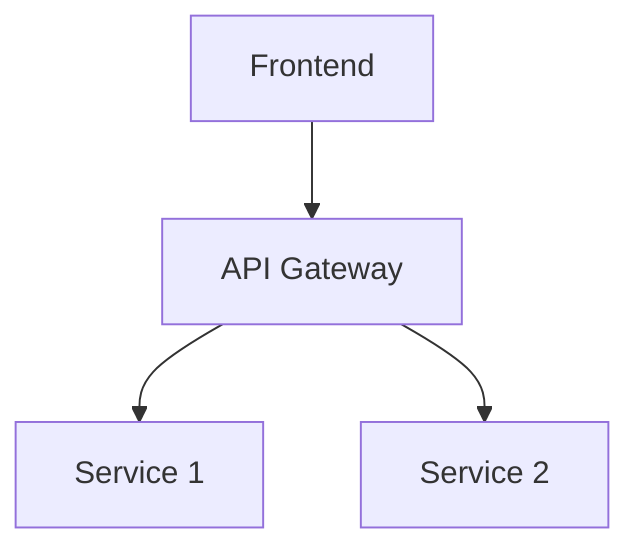

# Claude Code Advanced Workflow Optimization Guide

A comprehensive guide to maximizing your Claude Code productivity through advanced features, integrations, and workflow patterns.

## Table of Contents

1. [MCP (Model Context Protocol) Servers](#mcp-servers)
2. [Hooks System](#hooks-system)
3. [Context Optimization Strategies](#context-optimization)
4. [Advanced CLI Patterns](#advanced-cli-patterns)
5. [Workflow Orchestration](#workflow-orchestration)
6. [Performance Monitoring](#performance-monitoring)
7. [Team Collaboration Patterns](#team-collaboration)
8. [Advanced Command Techniques](#advanced-command-techniques)
9. [Security & Compliance](#security-compliance)
10. [Learning & Improvement](#learning-improvement)
11. [Integration Patterns](#integration-patterns)
12. [Meta-Optimization](#meta-optimization)
13. [Claude Code as a Service](#claude-as-service)
14. [Distributed Claude Systems](#distributed-claude)
15. [Advanced Cost Optimization](#cost-optimization)
16. [Claude Code Testing Framework](#testing-framework)
17. [Real-time Collaboration](#realtime-collaboration)
18. [Semantic Codebase Understanding](#semantic-understanding)
19. [Implementation Roadmap](#implementation-roadmap)

## MCP (Model Context Protocol) Servers {#mcp-servers}

MCP enables Claude Code to connect with external services and tools, dramatically expanding its capabilities.

### Built-in MCP Capabilities

```bash
# Run Claude Code as an MCP server
claude mcp serve

# Connect to MCP servers
claude --mcp-server postgres://localhost:5432
```

### Popular MCP Integrations

#### Database MCP
```javascript
// .claude/mcp-config.json
{
  "servers": {
    "postgres": {
      "command": "mcp-postgres",
      "args": ["--connection-string", "${POSTGRES_URL}"]
    }
  }
}
```
- Direct SQL queries without leaving Claude Code
- Schema exploration and data analysis
- Migration generation

#### GitHub MCP (beyond gh CLI)
```javascript
{
  "servers": {
    "github": {
      "command": "mcp-github",
      "args": ["--token", "${GITHUB_TOKEN}"]
    }
  }
}
```
- Issue/PR management
- Code search across organizations
- Workflow automation

#### Custom MCP Server Example
```python
# custom-mcp-server.py
from mcp import Server, Tool

class CustomMCPServer(Server):
    @Tool("analyze_metrics")
    async def analyze_metrics(self, metric_type: str):
        # Your custom logic here
        return await self.fetch_and_analyze(metric_type)

# Connect: claude --mcp-server python://custom-mcp-server.py
```

### MCP Server Ideas
- **Jira/Linear**: Project management integration
- **Datadog/NewRelic**: Performance metrics access
- **Slack/Discord**: Team notifications
- **AWS/GCP**: Cloud resource management
- **Kubernetes**: Cluster operations
- **Elasticsearch**: Log analysis

## Hooks System {#hooks-system}

Automate workflows by triggering actions based on Claude's operations.

### Hook Configuration
```yaml
# .claude/hooks.yaml
hooks:
  pre-edit:
    - command: "eslint --fix {file}"
      pattern: "*.js"
    - command: "black {file}"
      pattern: "*.py"
  
  post-edit:
    - command: "npm test -- {file}"
      pattern: "*.test.js"
    - command: "git add {file}"
      when: "no-errors"
  
  pre-commit:
    - command: "npm run lint"
    - command: "npm run type-check"
    - command: "npm test"
  
  on-error:
    - command: "notify-send 'Claude Error' '{error}'"
    - command: "echo '{error}' >> .claude/error.log"
```

### Advanced Hook Patterns

#### Conditional Hooks
```yaml
hooks:
  post-edit:
    - command: "npm run build"
      when:
        - file_changed: "src/**/*"
        - not_file: "*.test.js"
```

#### Chain Reactions
```yaml
hooks:
  post-edit:
    - trigger: "documentation-update"
      when:
        file_changed: "src/api/**/*"
  
  documentation-update:
    - command: "npm run generate-api-docs"
    - command: "git add docs/api/*"
```

#### Security Hooks
```yaml
hooks:
  pre-commit:
    - command: "gitleaks detect --source=. --verbose"
      fail_on_error: true
    - command: "npm audit"
      fail_on_error: true
```

## Context Optimization Strategies {#context-optimization}

Maximize Claude's understanding while minimizing token usage.

### Advanced CLAUDE.md Patterns

```markdown
# CLAUDE.md

## Architecture Overview


## Decision Log
| Date | Decision | Rationale | Impact |
|------|----------|-----------|--------|
| 2024-01-15 | Use PostgreSQL | Performance needs | High |
| 2024-01-20 | Adopt TypeScript | Type safety | Medium |

## Code Patterns
### Service Creation Pattern
```typescript
// Always use this pattern for new services
export class ServiceName extends BaseService {
  constructor(private deps: Dependencies) {
    super();
  }
}
```

## Common Issues & Solutions
- **Issue**: Slow API responses
  **Solution**: Check database indexes first
  **Command**: `/debug-slow-api`

## Performance Baselines
- API response time: <200ms
- Build time: <30s
- Test suite: <2min
```

### Strategic .claudeignore
```gitignore
# .claudeignore
# Large generated files
dist/
build/
coverage/
*.min.js
*.map

# Irrelevant for coding
*.jpg
*.png
*.pdf
docs/videos/

# Sensitive data
.env.production
secrets/
*.key
*.pem

# Large dependencies
node_modules/
vendor/
.venv/

# But include specific important files
!node_modules/important-local-package/
!build/config/
```

### Modular Context Loading
```
.claude/
├── context/
│   ├── architecture.md      # Load with: @architecture
│   ├── api-patterns.md      # Load with: @api-patterns
│   ├── testing-guide.md     # Load with: @testing-guide
│   └── troubleshooting.md   # Load with: @troubleshooting
├── commands/
└── hooks/
```

### Context Priming Commands
```markdown
# .claude/commands/context-prime.md
Review these key files to understand the project:
1. Read CLAUDE.md for project overview
2. Read src/config/constants.ts for configuration
3. Read src/types/index.ts for type definitions
4. List src/services/ to understand service structure
5. Read package.json for dependencies

Acknowledge when ready to proceed.
```

## Advanced CLI Patterns {#advanced-cli-patterns}

### Pipe Chains & Stream Processing
```bash
# Find and refactor all TODO comments
grep -r "TODO" --include="*.js" | 
  cut -d: -f1 | 
  sort -u | 
  xargs -I {} claude -p "Implement the TODO in {}"

# Analyze git changes
git diff --name-only main | 
  claude -p "Review these changed files for breaking changes"

# Process CSV data
cat sales_data.csv | 
  claude -p "Generate a Python script to analyze trends" |
  python > analysis_report.md
```

### Watch Mode (Unofficial)
```bash
# Auto-fix on file change
fswatch -o src/ | xargs -n1 -I{} sh -c \
  'claude -p "Check and fix any issues in the changed files"'

# Continuous testing
while true; do
  inotifywait -e modify -r src/
  claude -p "Run tests for changed files"
done
```

### Batch Processing
```bash
# Parallel refactoring
find . -name "*.py" -type f | 
  parallel -j 4 claude -p "Modernize Python code in {}"

# Sequential with progress
for file in $(find . -name "*.test.js"); do
  echo "Processing $file..."
  claude -p "Optimize test performance in $file"
done

# Conditional processing
find . -name "*.go" -size +100k | 
  while read file; do
    claude -p "Split $file into smaller modules if appropriate"
  done
```

### CI/CD Integration
```yaml
# .github/workflows/claude-review.yml
name: Claude Code Review
on: [pull_request]

jobs:
  review:
    runs-on: ubuntu-latest
    steps:
      - uses: actions/checkout@v3
      - name: Claude Review
        run: |
          changed_files=$(git diff --name-only origin/main)
          claude -p "Review these files for issues: $changed_files" \
            --json > review.json
          
          # Post review comments
          jq -r '.issues[]' review.json | 
            while read issue; do
              gh pr comment --body "$issue"
            done
```

## Workflow Orchestration {#workflow-orchestration}

### Claude-Flow Setup
```bash
# Install claude-flow
npm install -g claude-flow

# Initialize
claude-flow init

# Create workflow
claude-flow create feature-workflow
```

#### Multi-Agent Workflow Example
```yaml
# .claude-flow/workflows/feature.yaml
name: Complete Feature Development
agents:
  - name: architect
    role: Design the feature architecture
    context: 
      - src/architecture/
      - CLAUDE.md
    
  - name: implementer
    role: Implement the feature
    depends_on: architect
    context:
      - architect.output
      - src/
    
  - name: tester
    role: Write comprehensive tests
    depends_on: implementer
    context:
      - implementer.output
      - tests/
    
  - name: documenter
    role: Update documentation
    depends_on: [implementer, tester]
    context:
      - implementer.output
      - docs/

execution:
  parallel: true
  max_agents: 4
```

### Git Worktrees for Parallel Development
```bash
# Setup parallel workspaces
git worktree add ../project-feature-a feature-a
git worktree add ../project-feature-b feature-b
git worktree add ../project-bugfix bugfix

# Run Claude in each
tmux new-session -d -s claude-a \
  "cd ../project-feature-a && claude"
tmux new-session -d -s claude-b \
  "cd ../project-feature-b && claude"
tmux new-session -d -s claude-fix \
  "cd ../project-bugfix && claude"

# Monitor all sessions
tmux attach-session -t claude-a
```

### Queue System Integration
```python
# claude_queue.py
import redis
import subprocess
import json

r = redis.Redis()

def process_claude_tasks():
    while True:
        task = r.blpop('claude:tasks', timeout=1)
        if task:
            _, task_json = task
            task_data = json.loads(task_json)
            
            result = subprocess.run([
                'claude', '-p', task_data['prompt'],
                '--json'
            ], capture_output=True, text=True)
            
            r.lpush('claude:results', json.dumps({
                'task_id': task_data['id'],
                'result': result.stdout
            }))

# Queue tasks
r.lpush('claude:tasks', json.dumps({
    'id': 'task-123',
    'prompt': 'Refactor user service for better performance'
}))
```

## Performance Monitoring {#performance-monitoring}

### Token Usage Tracking
```bash
# Install ccusage
npm install -g ccusage

# Track usage
ccusage init
ccusage report --format=csv > usage_report.csv

# Analyze patterns
ccusage analyze --by-command --top=10
```

### Custom Metrics Dashboard
```javascript
// .claude/metrics.js
const fs = require('fs');
const { execSync } = require('child_process');

class ClaudeMetrics {
  constructor() {
    this.metrics = [];
  }
  
  trackCommand(command, startTime) {
    const endTime = Date.now();
    const duration = endTime - startTime;
    
    const metric = {
      command,
      duration,
      timestamp: new Date().toISOString(),
      tokenUsage: this.getTokenUsage(),
      success: true
    };
    
    this.metrics.push(metric);
    this.save();
  }
  
  getTokenUsage() {
    // Parse from Claude output or API
    return parseInt(execSync('ccusage last --json').toString());
  }
  
  generateReport() {
    const avgDuration = this.metrics.reduce((a, b) => 
      a + b.duration, 0) / this.metrics.length;
    
    const byCommand = {};
    this.metrics.forEach(m => {
      if (!byCommand[m.command]) {
        byCommand[m.command] = [];
      }
      byCommand[m.command].push(m);
    });
    
    return {
      totalCommands: this.metrics.length,
      averageDuration: avgDuration,
      byCommand,
      tokenEfficiency: this.calculateEfficiency()
    };
  }
}
```

### A/B Testing Commands
```markdown
# .claude/commands/refactor-a.md
Refactor using functional programming patterns

# .claude/commands/refactor-b.md  
Refactor using object-oriented patterns

# Test both approaches
claude /refactor-a src/service.js > result-a.js
claude /refactor-b src/service.js > result-b.js

# Compare results
claude -p "Compare these two refactoring approaches" \
  result-a.js result-b.js
```

## Team Collaboration Patterns {#team-collaboration}

### Shared Command Libraries
```bash
# Create shared command repository
git init claude-commands-shared
cd claude-commands-shared

# Organize by team/domain
mkdir -p commands/{frontend,backend,devops,testing}

# Add as submodule to projects
cd ../my-project
git submodule add git@github.com:team/claude-commands-shared \
  .claude/shared-commands
```

### Command Versioning
```markdown
# .claude/commands/api-create.md
---
version: 2.0.0
changelog:
  - 2.0.0: Added GraphQL support
  - 1.2.0: Added validation
  - 1.0.0: Initial version
---

Create new API endpoint with all standards...
```

### Team Knowledge Base
```markdown
# .claude/team-knowledge/README.md
## Proven Patterns

### Debugging Production Issues
1. Always check `/debug-production` first
2. Use ultrathink for complex issues
3. Document solution in troubleshooting.md

### Code Review Process
1. Run `/review-security` first
2. Then `/review-performance`
3. Finally `/review-code-quality`

## Common Pitfalls
- Don't use `think harder` for simple tasks (wastes tokens)
- Always run hooks in test mode first
- Clear context between major task switches
```

### Pair Programming with Claude
```bash
# Start screen session
screen -S claude-pair

# Share with teammate
screen -x claude-pair

# Use markers for clarity
echo "=== ALICE DRIVING ===" 
claude -p "Implement user authentication"

echo "=== BOB REVIEWING ==="
claude -p "Review the authentication implementation"
```

## Advanced Command Techniques {#advanced-command-techniques}

### Conditional Commands
```markdown
# .claude/commands/test-smart.md
Determine the project type and run appropriate tests:

@if(file_exists:package.json) {
  @if(dependency:jest) Run: npm test
  @if(dependency:mocha) Run: npm run mocha
}

@if(file_exists:go.mod) Run: go test ./...

@if(file_exists:Cargo.toml) Run: cargo test

@if(file_exists:pytest.ini) Run: pytest
```

### Command Chaining
```markdown
# .claude/commands/feature-complete.md
Execute these commands in sequence:

1. /analyze-requirements $ARGUMENTS
2. /create-implementation-plan
3. /implement-feature
4. /write-tests
5. /update-documentation
6. /create-pull-request

Stop if any step fails.
```

### Variable Extraction
```markdown
# .claude/commands/smart-fix.md
@extract(issue_number) from current git branch name
@extract(issue_description) from `gh issue view $issue_number`
@extract(affected_files) from issue description

Focus on fixing issue #$issue_number: $issue_description
Priority files: $affected_files
```

### Dynamic Command Generation
```python
# generate_commands.py
def create_migration_command(from_version, to_version):
    return f"""
# Migration from {from_version} to {to_version}

1. Read migration guide for {to_version}
2. Search for deprecated features from {from_version}
3. Update dependencies in package.json
4. Run codemods if available
5. Fix breaking changes
6. Update tests
"""

# Generate versioned commands
for old, new in [("v1", "v2"), ("v2", "v3")]:
    with open(f".claude/commands/migrate-{old}-{new}.md", "w") as f:
        f.write(create_migration_command(old, new))
```

## Security & Compliance {#security-compliance}

### Audit Logging
```bash
# .claude/hooks/audit.sh
#!/bin/bash
LOG_FILE=".claude/audit.log"

log_action() {
  echo "[$(date -u +%Y-%m-%dT%H:%M:%SZ)] $USER: $1" >> $LOG_FILE
}

# Hook into Claude operations
claude() {
  log_action "COMMAND: $*"
  command claude "$@"
  log_action "RESULT: $?"
}
```

### Permission Boundaries
```yaml
# .claude/permissions.yaml
file_access:
  allow:
    - "src/**/*"
    - "tests/**/*"
    - "docs/**/*"
  deny:
    - "**/*.env"
    - "**/secrets/**"
    - "**/*.pem"
    - "**/*.key"

command_execution:
  allow:
    - "npm"
    - "git"
    - "jest"
  deny:
    - "rm -rf"
    - "sudo"
    - "curl"
```

### Compliance Templates
```markdown
# .claude/commands/gdpr-audit.md
Perform GDPR compliance audit:

1. Search for personal data processing
   - Look for: email, name, phone, address, IP
   - Check data retention policies
   
2. Verify consent mechanisms
   - Find consent collection points
   - Check consent storage
   
3. Review data deletion capabilities
   - Find user deletion endpoints
   - Verify cascade deletes

4. Check data export functionality
   - Find data export endpoints
   - Verify completeness

Generate report in docs/gdpr-audit.md
```

## Learning & Improvement {#learning-improvement}

### Command Analytics
```python
# analyze_claude_usage.py
import json
from collections import Counter
from datetime import datetime, timedelta

def analyze_command_effectiveness():
    with open('.claude/metrics.json') as f:
        metrics = json.load(f)
    
    # Most used commands
    command_usage = Counter(m['command'] for m in metrics)
    
    # Time saved analysis
    time_saved = {}
    for metric in metrics:
        command = metric['command']
        manual_time = estimate_manual_time(command)
        time_saved[command] = manual_time - metric['duration']
    
    # Success rate
    success_rate = {}
    for command in command_usage:
        successes = sum(1 for m in metrics 
                       if m['command'] == command and m['success'])
        success_rate[command] = successes / command_usage[command]
    
    return {
        'most_used': command_usage.most_common(10),
        'most_time_saved': sorted(time_saved.items(), 
                                 key=lambda x: x[1], reverse=True)[:10],
        'highest_success_rate': sorted(success_rate.items(), 
                                     key=lambda x: x[1], reverse=True)[:10]
    }
```

### Failure Analysis
```markdown
# .claude/commands/analyze-failures.md
Review recent Claude failures:

1. Read .claude/error.log
2. Group errors by type
3. For each error type:
   - Identify root cause
   - Suggest prevention strategy
   - Create new command if helpful

Output findings to .claude/failure-analysis.md
```

### Workflow Recording
```bash
# Record successful workflow
script -q .claude/sessions/feature-x.log claude

# Later, extract commands
grep "^claude" .claude/sessions/feature-x.log > \
  .claude/commands/feature-x-workflow.md
```

## Integration Patterns {#integration-patterns}

### IDE Deep Integration

#### VS Code Extension Configuration
```json
// .vscode/settings.json
{
  "claude-code": {
    "autoContext": true,
    "contextFiles": [
      "CLAUDE.md",
      "src/types/**/*.ts"
    ],
    "shortcuts": {
      "cmd+shift+r": "claude /refactor",
      "cmd+shift+t": "claude /test",
      "cmd+shift+d": "claude /document"
    }
  }
}
```

#### JetBrains Integration
```xml
<!-- .idea/claude.xml -->
<component name="ClaudeCodeIntegration">
  <option name="autoSync" value="true" />
  <option name="contextProvider" value="semantic" />
  <option name="keymap">
    <mapping key="ctrl+alt+C" command="/explain-code" />
    <mapping key="ctrl+alt+R" command="/refactor" />
  </option>
</component>
```

### Browser Extension
```javascript
// claude-browser-ext/content.js
// Adds "Send to Claude" context menu
chrome.contextMenus.create({
  id: "send-to-claude",
  title: "Send to Claude Code",
  contexts: ["selection"]
});

chrome.contextMenus.onClicked.addListener((info, tab) => {
  if (info.menuItemId === "send-to-claude") {
    const prompt = `Explain this code:\n\n${info.selectionText}`;
    // Send to local Claude instance
    fetch('http://localhost:8080/claude', {
      method: 'POST',
      body: JSON.stringify({ prompt })
    });
  }
});
```

### Mobile Workflows

#### Termux Setup (Android)
```bash
# Install Termux and Termux:API
pkg install claude-code nodejs git

# Setup workspace
git clone myrepo
cd myrepo

# Voice control
termux-speech-to-text | xargs -I {} claude -p "{}"
```

#### iOS Shortcuts Integration
```javascript
// Scriptable app script
const prompt = args.shortcutParameter;
const response = await fetch('http://my-server.com/claude', {
  method: 'POST',
  body: JSON.stringify({ prompt })
});
return response.text();
```

## Meta-Optimization {#meta-optimization}

### Self-Improving Commands
```markdown
# .claude/commands/improve-self.md
Analyze your own usage patterns and improve:

1. Read .claude/metrics.json
2. Identify most-used commands
3. For top 5 commands:
   - Analyze if they can be optimized
   - Reduce token usage if possible
   - Improve success rate
4. Update command files with improvements
5. Document changes in .claude/changelog.md
```

### Command Generators
```markdown
# .claude/commands/create-crud-commands.md
Generate CRUD commands for entity: $ARGUMENTS

1. Create these commands:
   - create-$ARGUMENTS.md
   - read-$ARGUMENTS.md  
   - update-$ARGUMENTS.md
   - delete-$ARGUMENTS.md
   - list-$ARGUMENTS.md

2. Include in each:
   - Validation steps
   - Error handling
   - Testing
   - Documentation updates

3. Save to .claude/commands/crud/
```

### Workflow Learning
```python
# learn_patterns.py
import json
from sklearn.cluster import KMeans
from sklearn.feature_extraction.text import TfidfVectorizer

def learn_workflow_patterns():
    # Load command history
    with open('.claude/history.json') as f:
        history = json.load(f)
    
    # Extract command sequences
    sequences = extract_sequences(history)
    
    # Vectorize and cluster
    vectorizer = TfidfVectorizer()
    X = vectorizer.fit_transform(sequences)
    
    kmeans = KMeans(n_clusters=10)
    clusters = kmeans.fit_predict(X)
    
    # Generate workflow commands
    for i, cluster in enumerate(set(clusters)):
        cluster_sequences = [s for s, c in zip(sequences, clusters) 
                           if c == cluster]
        workflow = generate_workflow(cluster_sequences)
        
        with open(f'.claude/commands/learned-workflow-{i}.md', 'w') as f:
            f.write(workflow)
```

### Predictive Commands
```javascript
// .claude/predict.js
const predictNextCommand = (history) => {
  // Simple Markov chain
  const transitions = {};
  
  for (let i = 0; i < history.length - 1; i++) {
    const current = history[i].command;
    const next = history[i + 1].command;
    
    if (!transitions[current]) {
      transitions[current] = {};
    }
    
    transitions[current][next] = 
      (transitions[current][next] || 0) + 1;
  }
  
  const lastCommand = history[history.length - 1].command;
  const predictions = transitions[lastCommand] || {};
  
  return Object.entries(predictions)
    .sort((a, b) => b[1] - a[1])
    .slice(0, 3)
    .map(([cmd]) => cmd);
};

// Suggest next commands
console.log("Suggested next commands:", predictNextCommand(history));
```

## Claude Code as a Service {#claude-as-service}

Transform Claude Code into a persistent service that other applications can consume.

### Claude Daemon Setup

```bash
# claude-daemon.sh
#!/bin/bash
# Run Claude as a background service with REST API

start_daemon() {
  nohup claude serve \
    --port 8080 \
    --api-key $CLAUDE_API_KEY \
    --log-file /var/log/claude/daemon.log \
    --pid-file /var/run/claude.pid &
}

# Systemd service
cat > /etc/systemd/system/claude-code.service <<EOF
[Unit]
Description=Claude Code Service
After=network.target

[Service]
Type=simple
User=claude
ExecStart=/usr/local/bin/claude serve --config /etc/claude/daemon.conf
Restart=always
RestartSec=10

[Install]
WantedBy=multi-user.target
EOF
```

### API Gateway Implementation

```python
# claude_api_gateway.py
from fastapi import FastAPI, HTTPException
from pydantic import BaseModel
import asyncio
import redis
import jwt

app = FastAPI()
redis_client = redis.Redis()

class ClaudeRequest(BaseModel):
    prompt: str
    context: dict = {}
    command: str = None
    auth_token: str

class ClaudeResponse(BaseModel):
    result: str
    tokens_used: int
    execution_time: float

@app.post("/api/v1/claude", response_model=ClaudeResponse)
async def claude_endpoint(request: ClaudeRequest):
    # Validate auth token
    if not validate_token(request.auth_token):
        raise HTTPException(401, "Invalid token")
    
    # Rate limiting
    if not check_rate_limit(request.auth_token):
        raise HTTPException(429, "Rate limit exceeded")
    
    # Queue request
    job_id = await queue_claude_request(request)
    
    # Wait for result with timeout
    result = await get_result_with_timeout(job_id, timeout=300)
    
    return ClaudeResponse(**result)

@app.websocket("/ws/claude")
async def websocket_endpoint(websocket: WebSocket):
    await websocket.accept()
    # Stream Claude responses in real-time
    async for message in claude_stream(websocket):
        await websocket.send_json(message)
```

### Multi-Tenant Architecture

```yaml
# claude-tenant-config.yaml
tenants:
  team-frontend:
    quota: 1000000  # tokens per day
    allowed_commands:
      - /react-*
      - /typescript-*
    context_path: /contexts/frontend/
    
  team-backend:
    quota: 2000000
    allowed_commands:
      - /python-*
      - /database-*
    context_path: /contexts/backend/
    
  team-devops:
    quota: 500000
    allowed_commands:
      - /deploy-*
      - /infrastructure-*
    restricted_tools:
      - Write  # Read-only access
```

## Distributed Claude Systems {#distributed-claude}

Scale Claude Code across multiple machines for massive parallel processing.

### Distributed Architecture

```python
# distributed_claude.py
import ray
from typing import List, Dict
import hashlib

@ray.remote
class ClaudeWorker:
    def __init__(self, worker_id: str):
        self.worker_id = worker_id
        self.claude_instance = self._init_claude()
    
    def process_task(self, task: Dict) -> Dict:
        result = self.claude_instance.run(task['prompt'])
        return {
            'task_id': task['id'],
            'worker_id': self.worker_id,
            'result': result
        }

class DistributedClaudeOrchestrator:
    def __init__(self, num_workers: int = 10):
        ray.init()
        self.workers = [ClaudeWorker.remote(f"worker-{i}") 
                       for i in range(num_workers)]
    
    def process_batch(self, tasks: List[Dict]) -> List[Dict]:
        # Distribute tasks across workers
        futures = []
        for i, task in enumerate(tasks):
            worker = self.workers[i % len(self.workers)]
            futures.append(worker.process_task.remote(task))
        
        # Collect results
        return ray.get(futures)
    
    def map_reduce_analysis(self, 
                          codebase_path: str, 
                          analysis_prompt: str) -> Dict:
        # Map phase: analyze each file
        files = self.get_all_files(codebase_path)
        map_tasks = [
            {'id': f, 'prompt': f"Analyze {f}: {analysis_prompt}"}
            for f in files
        ]
        
        map_results = self.process_batch(map_tasks)
        
        # Reduce phase: synthesize results
        reduce_prompt = f"Synthesize these analyses: {map_results}"
        return self.claude_instance.run(reduce_prompt)
```

### Load Balancing Strategy

```nginx
# nginx.conf for Claude load balancing
upstream claude_cluster {
    least_conn;
    server claude1.internal:8080 weight=3;
    server claude2.internal:8080 weight=2;
    server claude3.internal:8080 weight=1;
    
    # Health checks
    server claude1.internal:8080 max_fails=3 fail_timeout=30s;
}

server {
    listen 443 ssl;
    
    location /api/claude {
        proxy_pass http://claude_cluster;
        proxy_next_upstream error timeout http_500;
        proxy_connect_timeout 30s;
        proxy_send_timeout 300s;
        proxy_read_timeout 300s;
    }
}
```

## Advanced Cost Optimization {#cost-optimization}

Sophisticated strategies to minimize token usage while maximizing output quality.

### Smart Caching System

```python
# claude_cache.py
import hashlib
import json
from datetime import datetime, timedelta
import redis
from sentence_transformers import SentenceTransformer

class SemanticClaudeCache:
    def __init__(self):
        self.redis = redis.Redis()
        self.encoder = SentenceTransformer('all-MiniLM-L6-v2')
        self.similarity_threshold = 0.85
    
    def get_cache_key(self, prompt: str, context: dict) -> str:
        # Create semantic hash
        embedding = self.encoder.encode(prompt)
        semantic_hash = hashlib.md5(
            embedding.tobytes()
        ).hexdigest()[:8]
        
        # Add context hash
        context_hash = hashlib.md5(
            json.dumps(context, sort_keys=True).encode()
        ).hexdigest()[:8]
        
        return f"claude:cache:{semantic_hash}:{context_hash}"
    
    def find_similar_cached(self, prompt: str) -> Optional[dict]:
        # Get prompt embedding
        query_embedding = self.encoder.encode(prompt)
        
        # Search cached embeddings
        for key in self.redis.scan_iter("claude:cache:*"):
            cached = json.loads(self.redis.get(key))
            cached_embedding = np.array(cached['embedding'])
            
            # Calculate similarity
            similarity = cosine_similarity(
                [query_embedding], 
                [cached_embedding]
            )[0][0]
            
            if similarity > self.similarity_threshold:
                return cached
        
        return None
    
    def should_use_cache(self, prompt: str, task_type: str) -> bool:
        # Don't cache time-sensitive queries
        if any(word in prompt.lower() for word in 
               ['today', 'now', 'current', 'latest']):
            return False
        
        # Don't cache creative tasks
        if task_type in ['creative', 'brainstorm', 'design']:
            return False
        
        # Cache deterministic tasks
        if task_type in ['refactor', 'explain', 'analyze']:
            return True
        
        return True
```

### Token-Efficient Prompting

```python
# token_optimizer.py
from transformers import GPT2TokenizerFast
import re

class TokenOptimizer:
    def __init__(self):
        self.tokenizer = GPT2TokenizerFast.from_pretrained("gpt2")
        self.abbreviations = {
            "function": "fn",
            "variable": "var",
            "parameter": "param",
            "return": "ret",
            "implement": "impl",
            "refactor": "rfctr",
            "optimize": "opt",
            "performance": "perf",
            "configuration": "config"
        }
    
    def compress_prompt(self, prompt: str) -> str:
        # Remove redundant whitespace
        prompt = re.sub(r'\s+', ' ', prompt)
        
        # Apply abbreviations
        for full, abbrev in self.abbreviations.items():
            prompt = prompt.replace(full, abbrev)
        
        # Remove filler words
        filler_words = ['please', 'could you', 'I need you to']
        for filler in filler_words:
            prompt = prompt.replace(filler, '')
        
        return prompt.strip()
    
    def chunk_large_context(self, 
                          context: str, 
                          max_tokens: int = 8000) -> List[str]:
        # Smart chunking that preserves semantic boundaries
        sentences = context.split('.')
        chunks = []
        current_chunk = []
        current_tokens = 0
        
        for sentence in sentences:
            sentence_tokens = len(self.tokenizer.encode(sentence))
            
            if current_tokens + sentence_tokens > max_tokens:
                chunks.append('.'.join(current_chunk) + '.')
                current_chunk = [sentence]
                current_tokens = sentence_tokens
            else:
                current_chunk.append(sentence)
                current_tokens += sentence_tokens
        
        if current_chunk:
            chunks.append('.'.join(current_chunk) + '.')
        
        return chunks
```

### Dynamic Model Selection

```python
# model_selector.py
class DynamicModelSelector:
    def __init__(self):
        self.task_patterns = {
            'simple_edit': {
                'patterns': [r'fix typo', r'rename variable', r'add comment'],
                'model': 'fast',
                'max_tokens': 1000
            },
            'complex_refactor': {
                'patterns': [r'refactor.*architecture', r'redesign.*system'],
                'model': 'powerful',
                'max_tokens': 30000
            },
            'code_review': {
                'patterns': [r'review.*security', r'analyze.*performance'],
                'model': 'balanced',
                'max_tokens': 10000
            }
        }
    
    def select_optimal_approach(self, prompt: str) -> dict:
        for task_type, config in self.task_patterns.items():
            if any(re.search(pattern, prompt, re.I) 
                   for pattern in config['patterns']):
                return config
        
        # Default to balanced approach
        return self.task_patterns['code_review']
```

## Claude Code Testing Framework {#testing-framework}

Comprehensive testing for Claude commands and workflows.

### Command Unit Testing

```python
# test_claude_commands.py
import pytest
from claude_test import ClaudeCommandTester

class TestRefactorCommand:
    @pytest.fixture
    def tester(self):
        return ClaudeCommandTester()
    
    def test_refactor_preserves_functionality(self, tester):
        # Given
        original_code = '''
        def calculate_total(items):
            total = 0
            for item in items:
                total += item.price * item.quantity
            return total
        '''
        
        # When
        result = tester.run_command('/refactor', original_code)
        
        # Then
        assert tester.functions_equivalent(original_code, result)
        assert 'reduce' in result or 'sum' in result  # More functional
        assert tester.passes_linting(result)
    
    def test_refactor_handles_edge_cases(self, tester):
        edge_cases = [
            '',  # Empty file
            '# Just comments',  # No code
            'syntax error here',  # Invalid syntax
        ]
        
        for case in edge_cases:
            result = tester.run_command('/refactor', case)
            assert not tester.introduced_errors(case, result)
    
    @pytest.mark.parametrize("language", ["python", "javascript", "go"])
    def test_refactor_multilanguage(self, tester, language):
        sample = tester.get_sample_code(language)
        result = tester.run_command('/refactor', sample)
        assert tester.valid_syntax(result, language)
```

### Workflow Integration Testing

```yaml
# .claude/test-workflows.yaml
test_suites:
  feature_development:
    setup:
      - create_test_repo
      - create_test_issue
    
    workflow:
      - command: /analyze-issue
        expect:
          - output_contains: "Understanding"
          - creates_files: [".claude/analysis.md"]
      
      - command: /implement-feature
        expect:
          - modifies_files: ["src/**/*.js"]
          - passes_tests: true
      
      - command: /create-pr
        expect:
          - creates_pr: true
          - pr_description_contains: ["fixes #", "testing"]
    
    teardown:
      - cleanup_test_repo
```

### Performance Benchmarking

```python
# benchmark_claude.py
import time
import statistics
from dataclasses import dataclass
from typing import List

@dataclass
class BenchmarkResult:
    command: str
    avg_time: float
    avg_tokens: int
    success_rate: float
    p95_time: float

class ClaudeBenchmark:
    def __init__(self):
        self.results = []
    
    def benchmark_command(self, 
                         command: str, 
                         test_cases: List[str], 
                         iterations: int = 10) -> BenchmarkResult:
        times = []
        tokens = []
        successes = 0
        
        for _ in range(iterations):
            for test_case in test_cases:
                start = time.time()
                result = run_claude_command(command, test_case)
                elapsed = time.time() - start
                
                times.append(elapsed)
                tokens.append(result.tokens_used)
                if result.success:
                    successes += 1
        
        return BenchmarkResult(
            command=command,
            avg_time=statistics.mean(times),
            avg_tokens=statistics.mean(tokens),
            success_rate=successes / (iterations * len(test_cases)),
            p95_time=statistics.quantiles(times, n=20)[18]  # 95th percentile
        )
    
    def compare_approaches(self):
        approaches = [
            ("basic", "Refactor this code"),
            ("think", "think about it. Refactor this code"),
            ("ultrathink", "ultrathink. Refactor this code"),
        ]
        
        for name, prompt in approaches:
            result = self.benchmark_command(prompt, self.test_cases)
            print(f"{name}: {result.avg_time:.2f}s, "
                  f"{result.avg_tokens} tokens, "
                  f"{result.success_rate:.1%} success")
```

## Real-time Collaboration {#realtime-collaboration}

Enable multiple users to work with the same Claude instance simultaneously.

### Collaborative Session Manager

```python
# collaborative_claude.py
import asyncio
from typing import Dict, Set
import websockets
import json
from dataclasses import dataclass

@dataclass
class CollaborativeSession:
    session_id: str
    participants: Set[str]
    context: dict
    command_queue: asyncio.Queue
    broadcast_channel: Set[websockets.WebSocketServerProtocol]

class CollaborativeClaudeServer:
    def __init__(self):
        self.sessions: Dict[str, CollaborativeSession] = {}
        self.user_sessions: Dict[str, str] = {}
    
    async def handle_client(self, websocket, path):
        user_id = await self.authenticate(websocket)
        session_id = path.strip('/')
        
        # Join or create session
        if session_id not in self.sessions:
            self.sessions[session_id] = CollaborativeSession(
                session_id=session_id,
                participants=set(),
                context={},
                command_queue=asyncio.Queue(),
                broadcast_channel=set()
            )
        
        session = self.sessions[session_id]
        session.participants.add(user_id)
        session.broadcast_channel.add(websocket)
        
        # Notify others
        await self.broadcast(session, {
            'type': 'user_joined',
            'user': user_id,
            'participants': list(session.participants)
        })
        
        try:
            async for message in websocket:
                data = json.loads(message)
                await self.handle_message(session, user_id, data)
        finally:
            session.participants.remove(user_id)
            session.broadcast_channel.remove(websocket)
    
    async def handle_message(self, session, user_id, data):
        if data['type'] == 'command':
            # Queue command for processing
            await session.command_queue.put({
                'user': user_id,
                'command': data['command'],
                'timestamp': time.time()
            })
            
            # Show typing indicator
            await self.broadcast(session, {
                'type': 'typing',
                'user': user_id
            })
            
            # Process with Claude
            result = await self.process_with_claude(
                data['command'], 
                session.context
            )
            
            # Broadcast result
            await self.broadcast(session, {
                'type': 'result',
                'user': user_id,
                'command': data['command'],
                'result': result
            })
        
        elif data['type'] == 'context_update':
            # Collaborative context editing
            session.context.update(data['changes'])
            await self.broadcast(session, {
                'type': 'context_changed',
                'user': user_id,
                'context': session.context
            })
```

### Conflict Resolution

```python
# conflict_resolver.py
class CollaborativeConflictResolver:
    def merge_concurrent_edits(self, 
                             base_content: str,
                             edit1: dict,
                             edit2: dict) -> str:
        # Use operational transformation
        if edit1['timestamp'] < edit2['timestamp']:
            first, second = edit1, edit2
        else:
            first, second = edit2, edit1
        
        # Apply first edit
        content = self.apply_edit(base_content, first)
        
        # Transform second edit based on first
        transformed = self.transform_edit(second, first)
        
        # Apply transformed edit
        return self.apply_edit(content, transformed)
    
    def handle_command_conflicts(self,
                               commands: List[dict]) -> List[dict]:
        # Detect conflicting commands
        conflicts = self.detect_conflicts(commands)
        
        if conflicts:
            # Let Claude resolve
            resolution_prompt = f"""
            These commands were issued simultaneously:
            {commands}
            
            They conflict because: {conflicts}
            
            Suggest an execution order or merged approach.
            """
            
            resolution = claude_resolve(resolution_prompt)
            return resolution['ordered_commands']
        
        return commands
```

## Semantic Codebase Understanding {#semantic-understanding}

Teach Claude deep understanding of your specific codebase patterns and conventions.

### Codebase Knowledge Graph

```python
# semantic_analyzer.py
import ast
import networkx as nx
from typing import Dict, List, Tuple

class CodebaseKnowledgeGraph:
    def __init__(self):
        self.graph = nx.DiGraph()
        self.embeddings = {}
        self.patterns = {}
    
    def analyze_codebase(self, root_path: str):
        for file_path in self.get_python_files(root_path):
            self.analyze_file(file_path)
        
        # Extract patterns
        self.patterns = self.extract_patterns()
        
        # Generate embeddings
        self.embeddings = self.generate_semantic_embeddings()
    
    def analyze_file(self, file_path: str):
        with open(file_path) as f:
            tree = ast.parse(f.read())
        
        for node in ast.walk(tree):
            if isinstance(node, ast.ClassDef):
                self.add_class(node, file_path)
            elif isinstance(node, ast.FunctionDef):
                self.add_function(node, file_path)
            elif isinstance(node, ast.Import):
                self.add_import(node, file_path)
    
    def extract_patterns(self) -> Dict[str, List[str]]:
        patterns = {
            'naming_conventions': self.detect_naming_patterns(),
            'architectural_patterns': self.detect_architectural_patterns(),
            'common_utilities': self.find_frequently_used_functions(),
            'error_handling': self.analyze_error_patterns(),
            'testing_patterns': self.analyze_test_patterns()
        }
        return patterns
    
    def generate_semantic_embeddings(self):
        # Create embeddings for code understanding
        embeddings = {}
        
        for node_id, node_data in self.graph.nodes(data=True):
            # Combine structural and semantic information
            context = self.get_node_context(node_id)
            embedding = self.encode_semantic_meaning(
                node_data['code'],
                context,
                self.patterns
            )
            embeddings[node_id] = embedding
        
        return embeddings
    
    def find_similar_code(self, 
                         code_snippet: str, 
                         top_k: int = 5) -> List[Tuple[str, float]]:
        # Find semantically similar code in the codebase
        query_embedding = self.encode_semantic_meaning(code_snippet)
        
        similarities = []
        for node_id, embedding in self.embeddings.items():
            similarity = cosine_similarity(query_embedding, embedding)
            similarities.append((node_id, similarity))
        
        return sorted(similarities, key=lambda x: x[1], reverse=True)[:top_k]
```

### Automated Documentation Maintenance

```python
# auto_documentation.py
class AutomaticDocumentationMaintainer:
    def __init__(self, knowledge_graph: CodebaseKnowledgeGraph):
        self.kg = knowledge_graph
        self.doc_templates = self.load_templates()
    
    def monitor_changes(self, changed_files: List[str]):
        for file_path in changed_files:
            # Analyze what changed
            changes = self.analyze_changes(file_path)
            
            # Determine documentation impact
            impacted_docs = self.find_impacted_documentation(changes)
            
            # Generate update prompts for Claude
            for doc in impacted_docs:
                self.queue_documentation_update(doc, changes)
    
    def generate_architecture_docs(self):
        # Auto-generate architecture documentation
        architecture = self.kg.extract_architecture()
        
        doc_prompt = f"""
        Based on this codebase analysis:
        {architecture}
        
        Generate comprehensive architecture documentation including:
        1. System overview
        2. Component relationships  
        3. Data flow diagrams
        4. Key design decisions
        5. Integration points
        """
        
        return claude_generate(doc_prompt)
    
    def maintain_api_docs(self):
        # Keep API documentation in sync
        api_changes = self.detect_api_changes()
        
        if api_changes:
            update_prompt = f"""
            The following API changes were detected:
            {api_changes}
            
            Update the API documentation to reflect these changes.
            Ensure examples are updated and breaking changes are highlighted.
            """
            
            updated_docs = claude_generate(update_prompt)
            self.apply_documentation_updates(updated_docs)
```

### Intelligent Context Switching

```python
# context_switcher.py
class IntelligentContextSwitcher:
    def __init__(self):
        self.contexts = {}
        self.active_context = None
        self.context_history = []
    
    def detect_optimal_context(self, 
                             user_prompt: str,
                             current_files: List[str]) -> str:
        # Analyze prompt intent
        intent = self.analyze_intent(user_prompt)
        
        # Check current file context
        file_context = self.analyze_file_context(current_files)
        
        # Determine optimal context
        if intent['type'] == 'debugging':
            return self.load_debugging_context(file_context)
        elif intent['type'] == 'feature_development':
            return self.load_feature_context(intent['feature_area'])
        elif intent['type'] == 'refactoring':
            return self.load_refactoring_context(file_context)
        else:
            return self.load_general_context()
    
    def preload_relevant_context(self, task_description: str):
        # Predictively load context based on task
        predicted_needs = self.predict_context_needs(task_description)
        
        context = {
            'files': [],
            'documentation': [],
            'patterns': [],
            'history': []
        }
        
        # Load predicted files
        for file_pattern in predicted_needs['likely_files']:
            context['files'].extend(self.find_files(file_pattern))
        
        # Load relevant documentation
        for doc_topic in predicted_needs['documentation_topics']:
            context['documentation'].append(
                self.load_documentation(doc_topic)
            )
        
        # Load similar past solutions
        for past_task in predicted_needs['similar_tasks']:
            context['history'].append(
                self.load_task_history(past_task)
            )
        
        return context
```

## Additional Advanced Techniques

### Voice-Driven Development

```python
# voice_claude.py
import speech_recognition as sr
import pyttsx3
from threading import Thread
import queue

class VoiceClaudeInterface:
    def __init__(self):
        self.recognizer = sr.Recognizer()
        self.microphone = sr.Microphone()
        self.tts_engine = pyttsx3.init()
        self.command_queue = queue.Queue()
        
        # Voice command patterns
        self.voice_commands = {
            "hey claude": self.activate_listening,
            "refactor this": self.trigger_refactor,
            "explain this code": self.trigger_explain,
            "run tests": self.trigger_tests,
            "commit changes": self.trigger_commit,
            "what's next": self.get_suggestions
        }
    
    def continuous_listening(self):
        with self.microphone as source:
            self.recognizer.adjust_for_ambient_noise(source)
            
        while True:
            try:
                # Listen for wake word
                audio = self.recognizer.listen(self.microphone, timeout=1)
                text = self.recognizer.recognize_google(audio).lower()
                
                if "hey claude" in text:
                    self.speak("I'm listening")
                    self.process_command()
                    
            except sr.WaitTimeoutError:
                pass
            except sr.UnknownValueError:
                pass
    
    def process_command(self):
        # Enhanced context awareness
        current_context = self.get_editor_context()
        
        audio = self.recognizer.listen(self.microphone, timeout=10)
        command = self.recognizer.recognize_google(audio)
        
        # Natural language to Claude command
        claude_prompt = f"""
        User voice command: "{command}"
        Current context: {current_context}
        
        Convert this to appropriate Claude Code action.
        """
        
        action = self.claude_interpret(claude_prompt)
        self.execute_action(action)
        self.speak(f"Executing: {action['summary']}")
```

### Claude Code Plugin System

```python
# claude_plugins.py
from abc import ABC, abstractmethod
import importlib.util
import os

class ClaudePlugin(ABC):
    @abstractmethod
    def get_commands(self) -> dict:
        """Return dict of command_name: handler_function"""
        pass
    
    @abstractmethod
    def get_hooks(self) -> dict:
        """Return dict of hook_name: handler_function"""
        pass
    
    @abstractmethod
    def get_tools(self) -> dict:
        """Return dict of tool_name: tool_function"""
        pass

class ClaudePluginManager:
    def __init__(self):
        self.plugins = {}
        self.commands = {}
        self.hooks = {}
        self.tools = {}
    
    def load_plugins(self, plugin_dir: str = "~/.claude/plugins"):
        plugin_path = os.path.expanduser(plugin_dir)
        
        for file in os.listdir(plugin_path):
            if file.endswith("_plugin.py"):
                self.load_plugin(os.path.join(plugin_path, file))
    
    def load_plugin(self, plugin_path: str):
        spec = importlib.util.spec_from_file_location("plugin", plugin_path)
        module = importlib.util.module_from_spec(spec)
        spec.loader.exec_module(module)
        
        # Find plugin class
        for item in dir(module):
            obj = getattr(module, item)
            if isinstance(obj, type) and issubclass(obj, ClaudePlugin):
                plugin = obj()
                self.register_plugin(plugin)
    
    def register_plugin(self, plugin: ClaudePlugin):
        # Register commands
        for cmd_name, handler in plugin.get_commands().items():
            self.commands[cmd_name] = handler
        
        # Register hooks
        for hook_name, handler in plugin.get_hooks().items():
            if hook_name not in self.hooks:
                self.hooks[hook_name] = []
            self.hooks[hook_name].append(handler)
        
        # Register tools
        self.tools.update(plugin.get_tools())

# Example plugin
class SecurityPlugin(ClaudePlugin):
    def get_commands(self):
        return {
            "/security-scan": self.security_scan,
            "/dependency-check": self.check_dependencies
        }
    
    def get_hooks(self):
        return {
            "pre-commit": self.pre_commit_security_check
        }
    
    def get_tools(self):
        return {
            "scan_secrets": self.scan_for_secrets
        }
```

### Claude Code Marketplace

```yaml
# claude-marketplace.yaml
marketplace:
  registry: https://claude-marketplace.ai
  
  categories:
    - name: "Productivity"
      commands:
        - id: "super-refactor-pro"
          price: "$4.99"
          rating: 4.8
          downloads: 10420
          
    - name: "Security"
      commands:
        - id: "pentest-suite"
          price: "$19.99"
          rating: 4.9
          downloads: 3201
          
    - name: "Team Collaboration"
      commands:
        - id: "team-sync-workflow"
          price: "Free"
          rating: 4.7
          downloads: 45102

# Install from marketplace
claude marketplace install super-refactor-pro
claude marketplace list --installed
claude marketplace update --all
```

### Energy-Efficient Claude

```python
# green_claude.py
import psutil
import GPUtil
from datetime import datetime

class GreenClaudeOptimizer:
    def __init__(self):
        self.energy_profile = self.load_energy_profile()
        self.carbon_intensity = self.get_grid_carbon_intensity()
    
    def should_defer_task(self, task_priority: str) -> bool:
        """Defer non-critical tasks during high carbon periods"""
        current_hour = datetime.now().hour
        
        # Check grid carbon intensity
        if self.carbon_intensity > 400 and task_priority != "critical":
            return True
        
        # Check if on battery power
        if self.on_battery_power() and task_priority == "low":
            return True
        
        return False
    
    def optimize_for_energy(self, prompt: str) -> dict:
        # Analyze task complexity
        complexity = self.estimate_complexity(prompt)
        
        if complexity == "simple":
            return {
                "model": "efficient",
                "max_tokens": 2000,
                "temperature": 0.3,
                "batch_with_similar": True
            }
        elif complexity == "medium":
            return {
                "model": "balanced",
                "max_tokens": 8000,
                "temperature": 0.5,
                "use_cache": True
            }
        else:
            # Complex tasks - check if can be deferred
            if self.should_defer_task("medium"):
                return {
                    "action": "defer",
                    "reason": "High carbon intensity period",
                    "retry_after": self.next_green_window()
                }
            return {
                "model": "powerful",
                "max_tokens": 30000,
                "temperature": 0.7
            }
    
    def batch_similar_tasks(self, tasks: list) -> list:
        """Group similar tasks to reduce model switching overhead"""
        grouped = {}
        for task in tasks:
            task_type = self.classify_task(task)
            if task_type not in grouped:
                grouped[task_type] = []
            grouped[task_type].append(task)
        
        # Return optimized execution order
        return self.optimize_execution_order(grouped)
```

### Claude Code Debugging Interface

```python
# claude_debugger.py
class ClaudeDebugger:
    def __init__(self):
        self.decision_log = []
        self.token_trace = []
        self.context_snapshots = []
    
    def trace_decision(self, decision_point: str, options: list, chosen: str, reasoning: str):
        self.decision_log.append({
            'timestamp': datetime.now(),
            'decision_point': decision_point,
            'options': options,
            'chosen': chosen,
            'reasoning': reasoning,
            'context_size': self.get_current_context_size()
        })
    
    def explain_behavior(self, unexpected_result: str) -> str:
        """Analyze why Claude produced unexpected result"""
        analysis_prompt = f"""
        Claude produced this unexpected result: {unexpected_result}
        
        Decision log: {self.decision_log[-10:]}
        Token usage: {self.token_trace[-5:]}
        Context at time: {self.context_snapshots[-1]}
        
        Explain what might have caused this behavior and suggest fixes.
        """
        
        return self.claude_analyze(analysis_prompt)
    
    def optimize_prompts(self, failed_prompts: list) -> dict:
        """Learn from failed prompts to improve future ones"""
        optimization_results = {}
        
        for prompt in failed_prompts:
            analysis = self.analyze_failure(prompt)
            optimization_results[prompt['id']] = {
                'original': prompt['text'],
                'improved': self.generate_improved_prompt(prompt, analysis),
                'changes': analysis['recommended_changes'],
                'expected_improvement': analysis['improvement_score']
            }
        
        return optimization_results
```

### Quantum-Inspired Task Scheduling

```python
# quantum_scheduler.py
import numpy as np
from qiskit import QuantumCircuit, execute, Aer

class QuantumTaskScheduler:
    """Use quantum-inspired algorithms for optimal task scheduling"""
    
    def __init__(self):
        self.backend = Aer.get_backend('qasm_simulator')
    
    def find_optimal_schedule(self, tasks: list, constraints: dict) -> list:
        # Create quantum circuit for task optimization
        n_qubits = int(np.ceil(np.log2(len(tasks))))
        qc = QuantumCircuit(n_qubits, n_qubits)
        
        # Encode task dependencies and constraints
        self.encode_constraints(qc, tasks, constraints)
        
        # Apply quantum optimization
        self.apply_qaoa(qc, tasks)
        
        # Measure and interpret results
        job = execute(qc, self.backend, shots=1000)
        result = job.result()
        counts = result.get_counts(qc)
        
        # Convert quantum result to task schedule
        optimal_schedule = self.decode_schedule(counts, tasks)
        return optimal_schedule
    
    def parallel_universe_exploration(self, codebase_change: str) -> list:
        """Explore multiple implementation paths simultaneously"""
        # This is a conceptual quantum-inspired approach
        universes = []
        
        # Create superposition of possible implementations
        for approach in self.generate_approaches(codebase_change):
            universe = {
                'approach': approach,
                'probability': self.calculate_success_probability(approach),
                'implementation': self.simulate_implementation(approach)
            }
            universes.append(universe)
        
        # Collapse to best universe
        best_universe = max(universes, key=lambda u: u['probability'])
        return best_universe['implementation']
```

## Implementation Roadmap {#implementation-roadmap}

### Week 1: Foundation
1. **Day 1-2**: Set up hooks system
   - Create `.claude/hooks/` directory
   - Implement pre-commit hooks
   - Add error logging

2. **Day 3-4**: Optimize context
   - Create comprehensive CLAUDE.md
   - Set up .claudeignore
   - Implement modular context loading

3. **Day 5-7**: Basic monitoring
   - Install ccusage
   - Set up metrics tracking
   - Create first dashboard

### Week 2: Integration
1. **Day 8-9**: MCP setup
   - Configure database MCP
   - Set up GitHub MCP
   - Test integrations

2. **Day 10-11**: Team collaboration
   - Create shared command repo
   - Document team patterns
   - Set up command versioning

3. **Day 12-14**: Advanced CLI
   - Implement pipe workflows
   - Set up batch processing
   - Create CI/CD integration

### Week 3: Automation
1. **Day 15-16**: Workflow orchestration
   - Install claude-flow
   - Create first multi-agent workflow
   - Set up parallel workspaces

2. **Day 17-18**: Security & compliance
   - Implement audit logging
   - Set up permission boundaries
   - Create compliance templates

3. **Day 19-21**: Learning systems
   - Implement analytics
   - Create self-improving commands
   - Set up pattern learning

### Week 4: Advanced
1. **Day 22-23**: Custom integrations
   - Build custom MCP server
   - Create browser extension
   - Set up mobile workflows

2. **Day 24-25**: Meta-optimization
   - Implement command generators
   - Create workflow learning
   - Build predictive system

3. **Day 26-28**: Polish & document
   - Refine all systems
   - Create team training
   - Document best practices

### Ongoing: Continuous Improvement
- Weekly command reviews
- Monthly workflow optimization
- Quarterly system upgrades
- Continuous learning integration

## Key Success Metrics

1. **Efficiency Metrics**
   - 50%+ reduction in development time
   - 80%+ command success rate
   - <2min average task completion

2. **Quality Metrics**
   - 90%+ test coverage maintained
   - Zero security vulnerabilities
   - 100% compliance adherence

3. **Team Metrics**
   - 100% team adoption
   - 50+ shared commands
   - <1 day onboarding time

## Conclusion

Claude Code is not just a tool—it's a platform for building your own AI-powered development environment. By implementing these advanced patterns, you transform Claude from a helpful assistant into a comprehensive development partner that learns, adapts, and scales with your team.

The key to maximum productivity is treating Claude Code as a programmable system, continuously optimizing based on data, and sharing successful patterns across your team. Start with the foundation, gradually add integrations, and always measure impact to ensure you're getting maximum value from every interaction.

## Final Thoughts

This guide represents the cutting edge of Claude Code optimization, from practical implementations you can use today to futuristic concepts that push the boundaries of AI-assisted development. The techniques range from simple hooks and context optimization to distributed systems, quantum-inspired scheduling, and voice-driven development.

Remember that the best optimization strategy depends on your specific needs:
- **Solo developers**: Focus on commands, context optimization, and performance monitoring
- **Small teams**: Prioritize shared commands, collaboration patterns, and consistent workflows  
- **Large organizations**: Implement Claude as a Service, distributed systems, and compliance frameworks
- **Innovation labs**: Explore voice interfaces, plugin systems, and quantum scheduling

The future of development is not just AI-assisted—it's AI-augmented, where Claude Code becomes an extension of your thinking, learning your patterns, anticipating your needs, and continuously improving alongside you.

Start small, measure everything, and never stop experimenting. The only limit is your imagination.