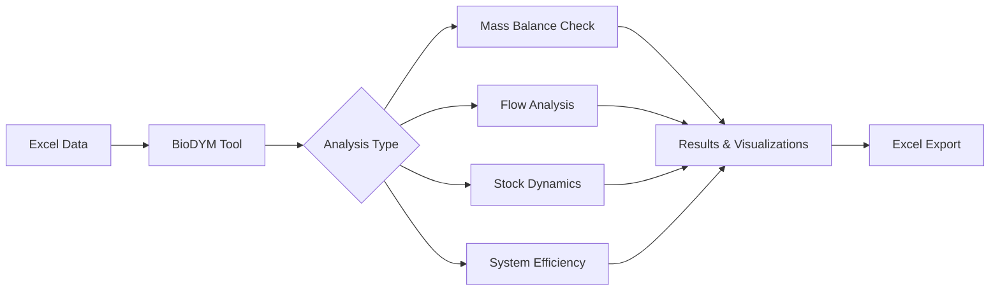

# BioDYM - Material Flow Analysis for Bio-based Systems

> **🚀 Beta Publication Version** - This branch contains the clean, publication-ready version of BioDYM

BioDYM is a comprehensive Material Flow Analysis (MFA) tool designed for analyzing bio-based material systems. Built on the [ODYM framework](https://github.com/IndEcol/ODYM), it tracks material flows, stocks, and transformations through time with special features for organic waste management and biomass cascading.

## 🎯 Key Features

### Core Analysis Capabilities
- **Material Flow Analysis (MFA)** - Track materials through complex systems
- **Multi-Element Analysis** - Simultaneously track material, carbon, nitrogen, and other elements
- **Time-Series Analysis** - Dynamic modeling over multiple years with temporal resolution
- **Dynamic Stock Modeling (DSM)** - Model material aging and product lifetimes
- **First-Order Mineralization (FOMP)** - Simulate organic matter decomposition (e.g., carbon in soil)

### Process Logic & Configuration
- **Excel-based Configuration** - Pure data input via Excel files, no programming required
- **Interactive Jupyter Notebook** - Step-by-step analysis workflow with guided execution
- **Process Logic Types** - Splitter and Transformer processes for different material transformations
- **Stock-Outflow Transfer Coefficients** - Custom ODYM extension for stock-driven flows

### Analysis & Visualization
- **Interactive Visualizations** - Sankey diagrams, stock plots, and dashboards
- **Scenario Manager** - Compare multiple scenarios and analyze sensitivity
- **Monte Carlo Simulation** - Quantify uncertainty in results
- **Mass Balance Validation** - Automatic system consistency checks

### Quality Assurance
- **Comprehensive Test Suite** - Validated calculations with extensive testing
- **Structured Workflow** - Organized analysis pipeline from data loading to export

## 🚀 Installation

You can set up the project environment using one of the two options below.

### Option 1: Using `uv` (Recommended for Speed)

This method uses `uv`, a very fast Python package manager.

1.  **Install Python**: Ensure you have Python 3.12 or newer installed on your system.
2.  **Install `uv`**: Open a terminal and install `uv` using `pip`:
    ```bash
    pip install uv
    ```
3.  **Create Environment and Install Dependencies**: Navigate to the project's root directory in your terminal and run:
    ```bash
    uv sync
    ```
    This command creates a local virtual environment (`.venv`) and installs all necessary packages from the `uv.lock` file.

### Option 2: Using `conda` / Anaconda (Recommended for Robustness)

This method is recommended for users who prefer Anaconda and for ensuring maximum compatibility with complex scientific packages.

1.  **Install Anaconda/Miniconda**: Download and install either [Anaconda Distribution](https://www.anaconda.com/download) or the lightweight [Miniconda](https://docs.conda.io/projects/miniconda/en/latest/).
2.  **Configure Conda (One-Time Best Practice)**: Open an Anaconda Prompt (or terminal) and run the following command. This helps prevent many common installation issues.
    ```bash
    conda config --set channel_priority strict
    ```
3.  **Create the Environment**: Navigate to the project's root directory and create the Conda environment from the provided file:
    ```bash
    conda env create -f environment.yml
    ```
    This will create a new environment named `biodym_env` with all the required packages.

---

## 📖 Usage

Once the environment is set up, you can run the analysis using the Jupyter Notebook.

### 1. Prepare Your Data

Copy an example Excel file to use as your input data. The Excel file contains all your system configuration, processes, flows, and parameters:

```bash
# Copy the wheat straw example (recommended for first-time users)
cp 01_data/01_input/251015_BioDYM_DataProtocoll_CS1_Wheat_Straw.xlsm my_analysis.xlsx

# Or use the clean template
cp 01_data/01_input/251015_BioDYM_DataProtocoll_Template.xlsm my_analysis.xlsx
```

> **Note**: `my_analysis.xlsx` is just a placeholder name - you can use any filename you prefer for your analysis.

### 2. Run the Jupyter Notebook

#### If you installed using `uv`:

1.  **Activate the environment**: The `uv` environment is activated automatically when using `uv run`.
2.  **Start Jupyter Lab**:
    ```bash
    uv run jupyter lab
    ```
3.  In the browser tab that opens, click on `00_BioDYM_Workflow.ipynb`.
4.  Update the `input_file` path in the notebook's first code cell to point to your Excel file (e.g., `my_analysis.xlsx`).

#### If you installed using `conda` / Anaconda:

You can either use the command line or the Anaconda Navigator GUI.

**A) Using the command line:**

1.  **Activate the environment**:
    ```bash
    conda activate biodym_env
    ```
2.  **Start Jupyter Lab**:
    ```bash
    jupyter lab
    ```
3.  In the browser tab that opens, click on `00_BioDYM_Workflow.ipynb`.
4.  Update the `input_file` path in the notebook's first code cell to point to your Excel file.

**B) Using Anaconda Navigator:**

1.  Open Anaconda Navigator and go to the **"Home"** tab.
2.  In the **"Applications on"** dropdown, select `biodym_env`.
3.  Click the **"Launch"** button on the "Jupyter Notebook" tile.
4.  In the browser tab that opens, navigate to your project folder.
5.  Click on `00_BioDYM_Workflow.ipynb` to open it and update the input file path.

### 3. Using in VS Code / Cursor

If you are using a code editor like VS Code or Cursor:

1.  Open the Command Palette (`Ctrl+Shift+P`).
2.  Run the **`Python: Select Interpreter`** command.
3.  Choose the correct environment:
    *   If you used `uv`, select the `.venv` environment.
    *   If you used `conda`, select the `biodym_env` environment.
4.  When you open a notebook, make sure to select the same environment as your kernel.

## 📖 Getting Started

### Understanding the Excel Input File

Your Excel file contains several sheets that define your material flow system:

- **`0_Configuration`** - Main settings (time range, elements, analysis options)
- **`1_1_Definition_Flows`** - Define all material flows in your system
- **`1_2_Data_Flows`** - Flow data over time
- **`2_1_Definition_Processes`** - Define processes and their logic types
- **`2_3_Process_TCs`** - Process transfer coefficients
- **`2_4_dynamic_tcs`** - Dynamic transfer coefficients over time
- **`2_5_Initial_Stock`** - Initial stock levels and stock-outflow TCs
- **`3_1_Definition_DSM`** - Dynamic Stock Model parameters
- **`3_2_Definition_FOMP`** - First-Order Mineralization Process parameters
- **`4_1_Uncertainty_Parameters`** - Monte Carlo uncertainty definitions
- **`5_1_Scenario_Manager`** - Scenario definitions for comparison
- **`6_1_Visualization_Processes`** - Process visualization settings
- **`6_2_Visualization_Flows`** - Flow visualization settings
- **`6_3_Layout_Configuration`** - Sankey diagram layout configuration

### Running Your First Analysis

1. **Open the Notebook**: Start Jupyter Lab and open `BioDYM_Scientific_Notebook.ipynb`
2. **Set Your Input File**: Update the `input_file` variable to point to your Excel file
3. **Run All Cells**: Execute the notebook cells in order
4. **Explore Results**: Interactive visualizations will appear automatically
5. **Export Data**: Results are saved to Excel files in `data/02_output/`

## 🔧 Project Structure

The BioDYM project follows a clean, flattened structure:

### Core Application
- **`src/`** - Core application source code
  - `engine/` - MFA calculation engine, DSM, FOMP, Monte Carlo
  - `plotting/` - Visualization modules and interactive charts
- **`framework/`** - ODYM framework and bioDYM extensions
- **`test/`** - Comprehensive test suite with unit and integration tests

### Data & Configuration
- **`data/`** - Input/output data and examples
  - `01_input/` - Example Excel files and templates
  - `02_output/` - Sample output files
- **`scenarios/`** - Scenario configuration files (JSON format) and comparison results (Excel)
- **`examples/`** - Basic examples and tutorials

### Documentation & Scripts
- **`docs/`** - Complete documentation and guides
- **`scripts/`** - Utility scripts for configuration generation
- **`BioDYM_Scientific_Notebook.ipynb`** - Main interactive analysis notebook

## 📊 Example Studies

### Included Examples

1. **Wheat Straw Analysis** (`250922_CS1_Wheat_Straw.xlsx`) - Complete wheat straw processing system with Monte Carlo analysis
2. **Template System** (`250625_Template_CS0.xlsx`) - Clean template for creating new analyses

### Example Outputs

- **Baseline Results** (`results_scientific_baseline.xlsx`) - Sample output showing comprehensive analysis results
- **Monte Carlo Results** (`mc_results_detailed.xlsx`) - Detailed uncertainty analysis outputs
- **Scientific Results** (`results_scientific.xlsx`) - Standard scientific analysis results
- **Configuration Results** (`results_scientific_config.xlsx`) - Configuration-driven analysis results

### Tutorial Examples

- **Circular Sankey Example** (`examples/circular_sankey_example.py`) - Interactive visualization tutorial
- **Monte Carlo User Interaction** (`examples/mc_user_interaction_example.py`) - Uncertainty analysis tutorial

## 💡 Common Use Cases

- **Waste Management** - Track organic waste through treatment systems
- **Circular Economy** - Analyze material recycling and cascading use
- **Carbon Accounting** - Follow carbon through biogenic systems
- **Resource Planning** - Optimize biomass utilization pathways

## 🛠️ System Requirements

- Python 3.12 or higher
- 4GB RAM minimum (8GB recommended for Monte Carlo)
- Windows, macOS, or Linux

## 📦 Dependency Management (uv)

- Install and sync dependencies (creates `.venv` if missing):

  ```bash
  uv sync
  ```

- Add a runtime dependency:

  ```bash
  uv add <package>
  ```

- Add a dev-only dependency (testing, linting, etc.):

  ```bash
  uv add --dev <package>
  ```

- Run commands in the project environment:

  ```bash
  uv run pytest
  uv run jupyter lab
  uv run python src/main_cli.py --help
  ```

## 📈 Workflow Overview



## 🤝 Contributing

We welcome contributions! Please see our [GitHub Issues](https://github.com/JScholz-tech/Biodym_JS/issues) for bug reports and feature requests.

## 📄 License

This project is licensed under the MIT License - see the [LICENSE](LICENSE) file for details.

## 🙏 Acknowledgments

- [ODYM Framework](https://github.com/IndEcol/ODYM) - The foundation for MFA calculations
- TU Berlin - Chair of Circular Economy and Recycling Technology
- All contributors and users who have helped improve BioDYM

## 📬 Getting Help

- **Issues**: Report bugs or request features on [GitHub Issues](https://github.com/JScholz-tech/Biodym_JS/issues)
- **Discussions**: Join our [GitHub Discussions](https://github.com/JScholz-tech/Biodym_JS/discussions)
- **Examples**: Start with the included `250922_CS1_Wheat_Straw.xlsx` example file

---

*Last updated: January 2025 | Version: 1.0*

## BioDYM Extension: Stock-Outflow Transfer Coefficients (TCs)

**Note:** This feature is a custom extension to the ODYM framework, developed specifically for BioDYM. It is **not** part of the standard ODYM release.

### What is it?

This extension allows you to define transfer coefficients (TCs) that control outflows directly from initial stocks of any process. It enables modeling of processes where material is gradually consumed from an initial stock, independent of regular inflows/outflows.

### Why was it added?

Standard ODYM does not provide a built-in mechanism for stock-driven outflows using user-defined TCs. Many real-world systems (e.g., landfills, storage, legacy stocks) require this feature for accurate modeling.

### How does it work?

- You can specify stock-outflow TCs directly in the `2_4_Initial_Stock` sheet of your input Excel file.
- For each process, you can define:
  - `Stock_Outflow_TC`: A unique ID for the stock-outflow TC
  - `Destination_Process`: The process that receives the outflow
  - `Annual_Consumption_Rate`: The fraction of the initial stock consumed per year (e.g., 0.1 for 10%/year)
- The BioDYM engine will automatically create flows that consume the initial stock at the specified rate and send it to the destination process.

### Example

| Process_ID | Initial_Stock_material | ... | Stock_Outflow_TC | Destination_Process | Annual_Consumption_Rate |
|------------|-----------------------|-----|------------------|--------------------|------------------------|
| 9          | 10000.0               | ... | STC_09_07        | 7                  | 0.1                    |

This will consume 10% of the initial stock of process 9 (Animal bedding) per year and send it to process 7 (Incineration).

### Code Location

- The main logic is implemented in `src/engine/solver.py` in the function `process_stock_outflow_tcs`.
- This function and related logic are clearly marked as BioDYM extensions in the code and documentation.

### Disclaimer

This feature is not part of the official ODYM framework and may not be compatible with future ODYM updates. It is maintained as part of the BioDYM project.
