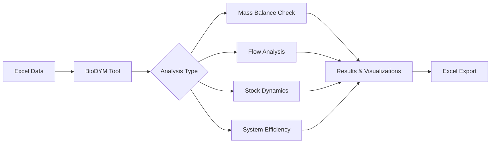

# BioDYM - Material Flow Analysis for Bio-based Systems

BioDYM is a comprehensive Material Flow Analysis (MFA) tool designed for analyzing bio-based material systems. Built on the [ODYM framework](https://github.com/IndEcol/ODYM), it tracks material flows, stocks, and transformations through time with special features for organic waste management and biomass cascading.

## 🎯 Key Features

- **Material Flow Analysis (MFA)** - Track materials through complex systems
- **Dynamic Stock Modeling (DSM)** - Model material aging and product lifetimes
- **First-Order Mineralization (FOMP)** - Simulate organic matter decomposition (e.g., carbon in soil)
- **Monte Carlo Simulation** - Quantify uncertainty in results
- **Interactive Visualizations** - Sankey diagrams, stock plots, and dashboards
- **Excel-based Configuration** - No programming required for basic use

## 🚀 Quick Start

### 1. Install BioDYM

```bash
# Clone the repository
git clone https://github.com/yourusername/Biodym_JS.git
cd Biodym_JS

# Install dependencies
pip install -r requirements.txt
```

### 2. Prepare Your Data

Generate an Excel template or use an existing example:

```bash
# Generate a new template
python biodym_mfa_tool/generate_excel_template.py

# Or use an example
cp biodym_mfa_tool/data/01_input/BioDYM_MFA_Input_Template.xlsx my_analysis.xlsx
```

### 3. Run Your Analysis

```bash
# Using the command line (recommended for beginners)
python biodym_mfa_tool/src/main_cli.py --input my_analysis.xlsx

# Or use Jupyter for interactive analysis
jupyter notebook
# Then open biodym_mfa_tool/BioDYM_MFA_Analysis.py
```

## 📚 Documentation

- **[Quick Start Tutorial](docs/QUICKSTART.md)** - Step-by-step guide using a simple example
- **[Excel Template Guide](docs/EXCEL_TEMPLATE_GUIDE.md)** - How to structure your input data
- **[Troubleshooting](docs/TROUBLESHOOTING.md)** - Common issues and solutions
- **[Migration Guide](docs/MIGRATION_GUIDE.md)** - Moving from old notebooks to the new tool

## 🔧 Tool Structure

BioDYM offers two approaches:

### Modern Modular Tool (Recommended)
Located in `biodym_mfa_tool/` - A production-ready application with:
- Command-line interface for easy automation
- Jupyter interface for interactive analysis  
- Modular Python API for custom workflows
- Comprehensive error checking and validation

### Legacy Notebooks
Located in `studies/` and `basic_examples/` - Original Jupyter notebooks for:
- Learning MFA concepts
- Understanding the mathematical foundations
- Reproducing published case studies

## 📊 Example Studies

### Basic Examples
1. **basic_example_1** - Simple biomass tracking with transfer coefficients
2. **basic_example_2** - Wheat harvesting with carbon content parameters

### Advanced Studies
1. **Rye Straw Cascading** - Biogas → Mycelium composites → Biochar → Soil
2. **Bachelor Thesis Case Study** - Agricultural residue management with Monte Carlo

## 💡 Common Use Cases

- **Waste Management** - Track organic waste through treatment systems
- **Circular Economy** - Analyze material recycling and cascading use
- **Carbon Accounting** - Follow carbon through biogenic systems
- **Resource Planning** - Optimize biomass utilization pathways

## 🛠️ System Requirements

- Python 3.8 or higher
- 4GB RAM minimum (8GB recommended for Monte Carlo)
- Windows, macOS, or Linux

## 📈 Workflow Overview



## 🤝 Contributing

We welcome contributions! Please see our [Contributing Guide](CONTRIBUTING.md) for details.

## 📄 License

This project is licensed under the MIT License - see the [LICENSE](LICENSE) file for details.

## 🙏 Acknowledgments

- [ODYM Framework](https://github.com/IndEcol/ODYM) - The foundation for MFA calculations
- TU Berlin - Chair of Circular Economy and Recycling Technology
- All contributors and users who have helped improve BioDYM

## 📬 Getting Help

- **Documentation**: Start with the [Quick Start Tutorial](docs/QUICKSTART.md)
- **Issues**: Report bugs or request features on [GitHub Issues](https://github.com/yourusername/Biodym_JS/issues)
- **Discussions**: Join our [GitHub Discussions](https://github.com/yourusername/Biodym_JS/discussions)

---

*Last updated: January 2025 | Version: 1.0*