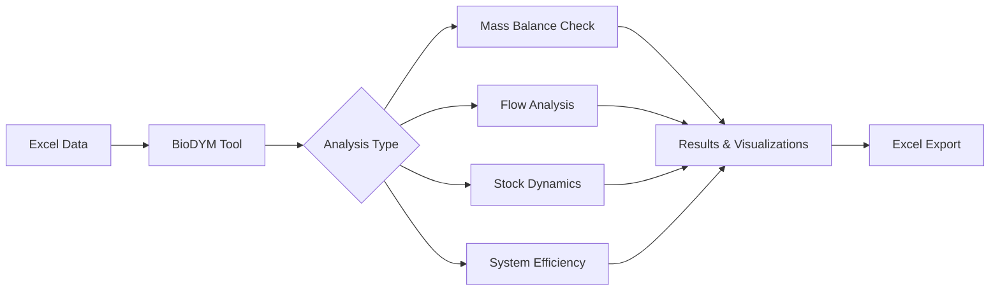

# BioDYM - Material Flow Analysis for Bio-based Systems

BioDYM is a comprehensive Material Flow Analysis (MFA) tool designed for analyzing bio-based material systems. Built on the [ODYM framework](https://github.com/IndEcol/ODYM), it tracks material flows, stocks, and transformations through time with special features for organic waste management and biomass cascading.

## 🎯 Key Features

- **Material Flow Analysis (MFA)** - Track materials through complex systems
- **Dynamic Stock Modeling (DSM)** - Model material aging and product lifetimes
- **First-Order Mineralization (FOMP)** - Simulate organic matter decomposition (e.g., carbon in soil)
- **Monte Carlo Simulation** - Quantify uncertainty in results
- **Interactive Visualizations** - Sankey diagrams, stock plots, and dashboards
- **Excel-based Configuration** - No programming required for basic use

## 🚀 Quick Start

### 1. Install BioDYM

```bash
# Clone the repository
git clone https://github.com/yourusername/Biodym_JS.git
cd Biodym_JS

# Install dependencies
pip install -r biodym_mfa_tool/requirements.txt
```

### 2. Prepare Your Data

Generate an Excel template or use an existing example:

```bash
# Generate a new template
python biodym_mfa_tool/generate_excel_template.py

# Or use an example
cp biodym_mfa_tool/data/01_input/BioDYM_MFA_Input_Template.xlsx my_analysis.xlsx
```

### 3. Run Your Analysis

```bash
# Using the command line (recommended for beginners)
python biodym_mfa_tool/src/main_cli.py --input my_analysis.xlsx

# Or use Jupyter for interactive analysis
jupyter notebook
# Then open biodym_mfa_tool/BioDYM_MFA_Analysis.py
```

## 📚 Documentation

- **[Quick Start Tutorial](biodym_mfa_tool/docs/QUICKSTART.md)** - Step-by-step guide using a simple example
- **[Excel Template Guide](biodym_mfa_tool/docs/EXCEL_TEMPLATE_GUIDE.md)** - How to structure your input data
- **[Troubleshooting](biodym_mfa_tool/docs/TROUBLESHOOTING.md)** - Common issues and solutions
- **[Migration Guide](biodym_mfa_tool/docs/MIGRATION_GUIDE.md)** - Moving from old notebooks to the new tool

## 🔧 Project Structure

The BioDYM project is organized as follows:

### Main Application (`biodym_mfa_tool/`)
- **`src/`** - Core application source code
- **`framework/`** - ODYM framework and bioDYM add-ons
- **`data/`** - Input/output data templates
- **`test_data/`** - Test datasets and golden dataset
- **`scenarios/`** - Scenario configuration files
- **`docs/`** - Complete documentation
- **`examples/`** - Basic examples and tutorials
- **`studies/`** - Case studies and research examples
- **`tests/`** - Comprehensive test suite
- **`installation/`** - Installation guides and Docker setup

### Legacy Content
- **`Archive/`** - Old notebooks and deprecated code
- **`BioDYM Databasestructure/`** - Database-related files

## 📊 Example Studies

### Basic Examples
1. **basic_example_1** - Simple biomass tracking with transfer coefficients
2. **basic_example_2** - Wheat harvesting with carbon content parameters

### Advanced Studies
1. **Rye Straw Cascading** - Biogas → Mycelium composites → Biochar → Soil
2. **Bachelor Thesis Case Study** - Agricultural residue management with Monte Carlo

## 💡 Common Use Cases

- **Waste Management** - Track organic waste through treatment systems
- **Circular Economy** - Analyze material recycling and cascading use
- **Carbon Accounting** - Follow carbon through biogenic systems
- **Resource Planning** - Optimize biomass utilization pathways

## 🛠️ System Requirements

- Python 3.8 or higher
- 4GB RAM minimum (8GB recommended for Monte Carlo)
- Windows, macOS, or Linux

## 📈 Workflow Overview



## 🤝 Contributing

We welcome contributions! Please see our [Contributing Guide](CONTRIBUTING.md) for details.

## 📄 License

This project is licensed under the MIT License - see the [LICENSE](LICENSE) file for details.

## 🙏 Acknowledgments

- [ODYM Framework](https://github.com/IndEcol/ODYM) - The foundation for MFA calculations
- TU Berlin - Chair of Circular Economy and Recycling Technology
- All contributors and users who have helped improve BioDYM

## 📬 Getting Help

- **Documentation**: Start with the [Quick Start Tutorial](biodym_mfa_tool/docs/QUICKSTART.md)
- **Issues**: Report bugs or request features on [GitHub Issues](https://github.com/yourusername/Biodym_JS/issues)
- **Discussions**: Join our [GitHub Discussions](https://github.com/yourusername/Biodym_JS/discussions)

---

*Last updated: January 2025 | Version: 1.0*

## BioDYM Extension: Stock-Outflow Transfer Coefficients (TCs)

**Note:** This feature is a custom extension to the ODYM framework, developed specifically for BioDYM. It is **not** part of the standard ODYM release.

### What is it?
This extension allows you to define transfer coefficients (TCs) that control outflows directly from initial stocks of any process. It enables modeling of processes where material is gradually consumed from an initial stock, independent of regular inflows/outflows.

### Why was it added?
Standard ODYM does not provide a built-in mechanism for stock-driven outflows using user-defined TCs. Many real-world systems (e.g., landfills, storage, legacy stocks) require this feature for accurate modeling.

### How does it work?
- You can specify stock-outflow TCs directly in the `2_4_Initial_Stock` sheet of your input Excel file.
- For each process, you can define:
  - `Stock_Outflow_TC`: A unique ID for the stock-outflow TC
  - `Destination_Process`: The process that receives the outflow
  - `Annual_Consumption_Rate`: The fraction of the initial stock consumed per year (e.g., 0.1 for 10%/year)
- The BioDYM engine will automatically create flows that consume the initial stock at the specified rate and send it to the destination process.

### Example
| Process_ID | Initial_Stock_material | ... | Stock_Outflow_TC | Destination_Process | Annual_Consumption_Rate |
|------------|-----------------------|-----|------------------|--------------------|------------------------|
| 9          | 10000.0               | ... | STC_09_07        | 7                  | 0.1                    |

This will consume 10% of the initial stock of process 9 (Animal bedding) per year and send it to process 7 (Incineration).

### Code Location
- The main logic is implemented in `src/engine/solver.py` in the function `process_stock_outflow_tcs`.
- This function and related logic are clearly marked as BioDYM extensions in the code and documentation.

### Disclaimer
This feature is not part of the official ODYM framework and may not be compatible with future ODYM updates. It is maintained as part of the BioDYM project.