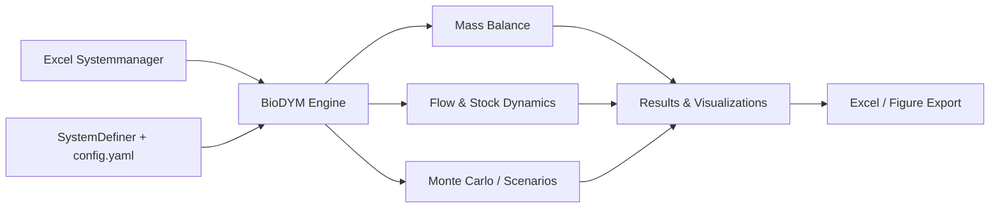

# bioDYM - Biogenic Dynamic Material Systems Model

[](https://opensource.org/licenses/MIT)
[](https://www.python.org/downloads/)
[](https://github.com/JScholz-tech/Biodym_JS/actions/workflows/ci.yml)
[](https://github.com/astral-sh/ruff)

BioDYM is a comprehensive Material Flow Analysis (MFA) tool designed for analyzing bio-based material systems. Built on the [ODYM framework](https://github.com/IndEcol/ODYM), it tracks material flows, stocks, and transformations through time with special features for organic waste management and biomass cascading.

## ⚡ Quick Start (5 minutes)

### Windows launcher (no terminal needed)

After BioDYM has been installed with `uv sync`, double-click
**`Start_BioDYM.vbs`** in the BioDYM folder. The launcher can start or stop the
BioDYM Dashboard and SystemDefiner and opens them in the default web browser.

The launcher must remain in the BioDYM folder. Use **Open logs** in the launcher
if an application does not start. If Windows blocks VBScript, use
`Start_BioDYM.cmd` instead.

1. **Install**: `uv sync` (or `conda env create -f environment.yml && conda activate biodym_env`)

2. **Define your system**: `uv run python -m systemdefiner` → opens **bioDYM SystemDefiner** at http://localhost:8001
   Tutorial studies T01–T14 are pre-loaded. Export your study as `config.yaml`.

3. **Run the analysis** — choose one:
   - **Dashboard** *(no code)*: `uv run voila 01_BioDYM_Dashboard.ipynb`
   - **Notebook** *(full control)*: `uv run jupyter lab` → open `00_BioDYM_Workflow.ipynb`

4. **Explore**: Interactive visualizations and exports appear automatically.

> New to BioDYM? Read [GETTING_STARTED_FROM_ZERO.md](GETTING_STARTED_FROM_ZERO.md) first.

**Need help?** See [Getting Help](#-getting-help) section below.

## 🎯 Key Features

### Core Analysis Capabilities
- **Material Flow Analysis (MFA)** - Track materials through complex systems
- **Multi-Element Analysis** - Simultaneously track material, carbon, nitrogen, and other elements
- **Time-Series Analysis** - Dynamic modeling over multiple years with temporal resolution
- **Dynamic Stock Modeling (DSM)** - Model material aging and product lifetimes
- **First-Order Mineralization (FOMP)** - Simulate organic matter decomposition (e.g., carbon in soil)

### Process Logic & Configuration
- **bioDYM SystemDefiner** - Visual web app for defining case studies and exporting YAML configs
  (`uv run python -m systemdefiner` → http://localhost:8001)
- **YAML-only workflow** - Run the full engine from a `config.yaml` without an Excel file
- **Excel-based Configuration** - Pure data input via Excel Systemmanager, no programming required
- **Interactive Jupyter Notebook** - Step-by-step analysis workflow with guided execution
- **Process Logic Types** - Splitter, Transformer, DSM, FOMP, LFG, BOM, FlowCap, and more
- **Stock-Outflow Transfer Coefficients** - Custom ODYM extension for stock-driven flows

### Analysis & Visualization
- **Interactive Visualizations** - Sankey diagrams, stock plots, and dashboards
- **Scenario Manager** - Compare multiple scenarios and analyze sensitivity
- **Monte Carlo Simulation** - Quantify uncertainty in results
- **Mass Balance Validation** - Automatic system consistency checks

### Quality Assurance
- **Comprehensive Test Suite** - Validated calculations with extensive testing
- **Structured Workflow** - Organized analysis pipeline from data loading to export

## 🚀 Quick Start

### 1. Install BioDYM

Choose either **UV** (recommended, faster) or **Anaconda** (more traditional):

#### Option A: UV Installation (Recommended)

```bash
# Clone the repository
git clone https://github.com/JScholz-tech/Biodym_JS.git
cd Biodym_JS

# Install uv if you don't have it
# On macOS/Linux: curl -LsSf https://astral.sh/uv/install.sh | sh
# On Windows: powershell -c "irm https://astral.sh/uv/install.ps1 | iex"

# Create virtual environment and install dependencies
uv sync
```

#### Option B: Anaconda Installation

```bash
# Clone the repository
git clone https://github.com/JScholz-tech/Biodym_JS.git
cd Biodym_JS

# Create conda environment from environment.yml
conda env create -f environment.yml

# Activate the environment
conda activate biodym_env
```

### 2. Prepare Your Data

The bundled BioDYM Systemmanager template is a **complete, runnable example** — the
workflow notebook points at it by default, so you can run a full analysis with no
setup. To build your own system, copy it to a working location and edit it. The
Excel file contains all system configuration, processes, flows, and parameters:

```bash
# Copy the template to your working location
cp 01_data/01_input/template/260503_bioDYM_Systemmanager_template_final.xlsm my_analysis.xlsm
```

> **Note**: `my_analysis.xlsm` is just a placeholder name — use any filename you prefer.

### 3. Run Your Analysis

**🎯 Option A: Voilà Dashboard (recommended for users)**

```bash
uv run voila 01_BioDYM_Dashboard.ipynb
```

A clean browser interface opens — enter the path to your `config.yaml` or `.xlsm` file and click Run. No coding required.

**🔬 Option B: Jupyter Notebook (recommended for developers)**

```bash
# UV users:
uv run jupyter lab

# Anaconda users:
jupyter lab

# Then open 00_BioDYM_Workflow.ipynb
# Update the input_file path in the notebook to point to your Excel or YAML file
```

**Experimental: Command Line Interface**

> ⚠️ The CLI (`02_src/main_cli.py`) is **experimental and not fully maintained** in
> step with the engine — it does not yet support all process-logic types (LFG, BOM,
> FlowCap) and may produce incomplete results. The **Jupyter notebook is the
> supported entry point**. Use the CLI only for quick smoke checks:

```bash
uv run python 02_src/main_cli.py --help
```

## 📖 Getting Started

### Understanding the Excel Input File

Your Excel file contains several sheets that define your material flow system:

- **`0_Configuration`** - Main settings (time range, elements, analysis options)
- **`1_1_Definition_Flows`** - Define all material flows in your system
- **`1_2_Data_Flows`** - Flow data over time
- **`2_1_Definition_Processes`** - Define processes and their logic types
- **`2_2_static_TCs`** - Static process transfer coefficients
- **`2_3_dynamic_TCs`** - Dynamic transfer coefficients over time
- **`2_4_Initial_Stock`** - Initial stock levels and stock-outflow TCs
- **`3_1_Definition_DSM`** - Dynamic Stock Model parameters
- **`3_2_Definition_FOMP`** - First-Order Mineralization Process parameters
- **`4_1_Uncertainty_Parameters`** - Monte Carlo uncertainty definitions
- **`5_1_Scenario_Manager`** - Scenario definitions for comparison
- **`6_1_Reference_Manager`** - Reference Manager and assumptions


### Running Your First Analysis

1. **Open the Notebook**: Start Jupyter Lab and open `00_BioDYM_Workflow.ipynb`
2. **Set Your Input File**: Update the `input_file` variable to point to your Excel file
3. **Run All Cells**: Execute the notebook cells in order (Kernel → Restart & Run All)
4. **Explore Results**: Interactive visualizations will appear automatically
5. **Export Data**: Results are saved to Excel files in `01_data/02_output/`

## 🔧 Project Structure

The BioDYM project follows a clean, organized structure. Top-level folders are
**number-prefixed to suggest a reading/workflow order** (`01_data` → `02_src` →
… → `06_framework`); the prefixes are organisational only. Because a digit-prefixed
folder can't be a Python import package, the source root `02_src/` is added to
`sys.path` at runtime (by the workflow notebook, the CLI, and the test harness)
rather than installed as a package — so run BioDYM from the repository root.

### Core Application
- **`02_src/`** - Core application source code
  - `engine/` - MFA calculation engine, DSM, FOMP, LFG, Monte Carlo
  - `plotting/` - Visualization modules and interactive charts
  - `reporting/` - KPI dashboards and reports
  - `systemdefiner/` - bioDYM SystemDefiner web app
- **`06_framework/`** - ODYM framework and BioDYM extensions
- **`04_tests/`** - Comprehensive test suite with unit and integration tests

### Data & Configuration
- **`01_data/`** - Input/output data and examples
  - `01_input/template/` - Blank Excel Systemmanager (starting point for Excel workflow)
  - `01_input/case_studies/T01_…T14_*/` - Tutorial studies (pre-loaded in SystemDefiner)
  - `02_output/` - Analysis results and exports
- **`03_studies/`** - Published case studies

### Documentation & Notebooks
- **`05_docs/`** - User manual (PDF) and documentation
- **`00_BioDYM_Workflow.ipynb`** - Main analysis notebook
- **`01_BioDYM_Dashboard.ipynb`** - Voilà dashboard
- **`GETTING_STARTED_FROM_ZERO.md`** - Step-by-step onboarding guide
- **`environment.yml`** - Anaconda environment specification
- **`pyproject.toml`** - UV/pip dependencies and project metadata

## 📊 Example Studies

### Included Template

The repository includes the BioDYM Systemmanager template:

- **`01_data/01_input/template/260503_bioDYM_Systemmanager_template_final.xlsm`** — Complete, runnable example system; also the starting point for a new analysis (the workflow notebook uses it by default)

### Tutorial Studies

14 tutorial studies (T01–T14) are included in `01_data/01_input/case_studies/` and open automatically in the bioDYM SystemDefiner. They cover all major process types from a simple first MFA (T01) to the reference manager (T14).

### Published Case Study

- **Wheat Straw Cascading (DGAW 2026)** — `03_studies/26_Weizenstroh_DGAW/` — Complete wheat straw system with Monte Carlo analysis. See the study [README](03_studies/26_Weizenstroh_DGAW/README.md) and [CITATION.bib](03_studies/26_Weizenstroh_DGAW/CITATION.bib).

### Generated Outputs

After running the workflow, results are written to `01_data/02_output/`:

| Folder | Content |
|--------|---------|
| `results/` | Baseline MFA results (Excel) |
| `composition/` | Flow composition data (Excel) |
| `kpi/` | System KPI dashboard (Excel) |
| `mc/` | Monte Carlo uncertainty results (Excel) |
| `figures/` | All exported publication figures (PNG/SVG) |
| `scenarios/` | Scenario comparison results (Excel) |

## 💡 Common Use Cases

- **Waste Management** - Track organic waste through treatment systems
- **Circular Economy** - Analyze material recycling and cascading use
- **Carbon Accounting** - Follow carbon through biogenic systems
- **Resource Planning** - Optimize biomass utilization pathways

## 🛠️ System Requirements

- Python 3.12 or higher
- 4GB RAM minimum (8GB recommended for Monte Carlo)
- Windows, macOS, or Linux

## 📦 Dependency Management

### UV Users

- Install and sync dependencies (creates `.venv` if missing):
  ```bash
  uv sync
  ```

- Add a runtime dependency:
  ```bash
  uv add <package>
  ```

- Add a dev-only dependency (testing, linting, etc.):
  ```bash
  uv add --dev <package>
  ```

- Run commands in the project environment:
  ```bash
  uv run pytest
  uv run jupyter lab
  uv run python 02_src/main_cli.py --help
  ```

### Anaconda Users

- Update environment from environment.yml:
  ```bash
  conda env update -f environment.yml --prune
  ```

- Install additional packages:
  ```bash
  conda activate biodym_env
  conda install <package>
  ```

- Run commands (after activating environment):
  ```bash
  pytest
  jupyter lab
  python 02_src/main_cli.py --help
  ```

## 📈 Workflow Overview



## 🧪 Testing

BioDYM includes a comprehensive test suite to ensure code quality and reliability:

```bash
# UV users:
uv run pytest

# Anaconda users:
pytest

# Run with verbose output:
pytest -v

# Run specific test file:
pytest 04_tests/test_solver.py
```

**Master Integration Test**: The main workflow notebook `00_BioDYM_Workflow.ipynb` serves as the comprehensive integration test. It should run successfully from start to finish after any code changes (Kernel → Restart & Run All).

## 📑 Cite This Software

If you use BioDYM in your research, please cite:

> Scholz, J. (2026). *BioDYM: Material Flow Analysis for Bio-based Systems* (v1.2.1).
> Zenodo. https://doi.org/10.5281/zenodo.20825821

[](https://doi.org/10.5281/zenodo.20825821)

> For a machine-readable citation and full version history, see [CITATION.cff](CITATION.cff).

A machine-readable citation is available in [CITATION.cff](CITATION.cff).

## 🤝 Contributing

We welcome contributions! Please see our [GitHub Issues](https://github.com/JScholz-tech/Biodym_JS/issues) for bug reports and feature requests.

## 📄 License

This project is licensed under the MIT License - see the [LICENSE](LICENSE) file for details.

## 🙏 Acknowledgments

- [ODYM Framework](https://github.com/IndEcol/ODYM) - The foundation for MFA calculations
- TU Berlin - Chair of Circular Economy and Recycling Technology
- All contributors and users who have helped improve BioDYM

## 📬 Getting Help

- **Issues**: Report bugs or request features on [GitHub Issues](https://github.com/JScholz-tech/Biodym_JS/issues)
- **Discussions**: Join our [GitHub Discussions](https://github.com/JScholz-tech/Biodym_JS/discussions)
- **Examples**: Start with the template in `01_data/01_input/template/`

---

*Last updated: June 2026 | Version: 1.2.1*

## BioDYM Extension: Stock-Outflow Transfer Coefficients (TCs)

**Note:** This feature is a custom extension to the ODYM framework, developed specifically for BioDYM. It is **not** part of the standard ODYM release.

### What is it?

This extension allows you to define transfer coefficients (TCs) that control outflows directly from initial stocks of any process. It enables modeling of processes where material is gradually consumed from an initial stock, independent of regular inflows/outflows.

### Why was it added?

Standard ODYM does not provide a built-in mechanism for stock-driven outflows using user-defined TCs. Many real-world systems (e.g., landfills, storage, legacy stocks) require this feature for accurate modeling.

### How does it work?

- You can specify stock-outflow TCs directly in the `2_4_Initial_Stock` sheet of your input Excel file.
- For each process, you can define:
  - `Stock_Outflow_TC`: A unique ID for the stock-outflow TC
  - `Destination_Process`: The process that receives the outflow
  - `Annual_Consumption_Rate`: The fraction of the initial stock consumed per year (e.g., 0.1 for 10%/year)
- The BioDYM engine will automatically create flows that consume the initial stock at the specified rate and send it to the destination process.

### Example

| Process_ID | Initial_Stock_material | ... | Stock_Outflow_TC | Destination_Process | Annual_Consumption_Rate |
|------------|-----------------------|-----|------------------|--------------------|------------------------|
| 9          | 10000.0               | ... | STC_09_07        | 7                  | 0.1                    |

This will consume 10% of the initial stock of process 9 (Animal bedding) per year and send it to process 7 (Incineration).

### Code Location

- The main logic is implemented in `02_src/engine/solver.py` and `02_src/engine/initial_stock_engine.py`.
- This function and related logic are clearly marked as BioDYM extensions in the code and documentation.

### Disclaimer

This feature is not part of the official ODYM framework and may not be compatible with future ODYM updates. It is maintained as part of the BioDYM project.
