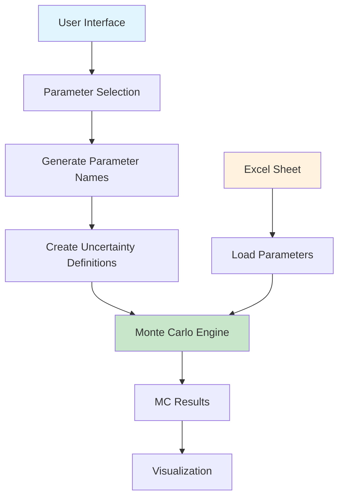

# Monte Carlo Integration Workflow

## 🎯 **How the New System Integrates with Existing MC Workflow**

### **Current Monte Carlo Workflow (Excel-Based)**

```
1. User manually creates Excel sheet: 4_1_Uncertainty_Parameters
2. User types parameter names: dsm_6_lifetimes_Mean_0, fomp_8_k1, etc.
3. System reads Excel sheet and runs Monte Carlo
4. Results are displayed in plots
```

### **New Codelist-Based Workflow**

```
1. User selects parameters via interface (no Excel needed)
2. System automatically generates Excel format
3. System runs Monte Carlo with generated parameters
4. Results are displayed in plots
```

---

## 📊 **Integration Options**

### **Option 1: Replace Excel Sheet (Recommended)**

**How it works:**
- ✅ **No Excel sheet needed** - parameters selected via interface
- ✅ **Automatic generation** - system creates parameter definitions
- ✅ **Seamless integration** - works with existing MC engine
- ✅ **User-friendly** - no need to know parameter names

**Implementation:**
```python
# User selects parameters via interface
selected_params = [
    "Transfer Coefficient: Harvest → Processing",
    "DSM Process 6 - Short-lived - Mean Lifetime"
]

# System automatically generates
uncertainty_params = {
    'TC_00_01': {'distribution': 'normal', 'mean': 0.8, 'std': 0.08},
    'dsm_6_lifetimes_Mean_0': {'distribution': 'normal', 'mean': 10, 'std': 1}
}

# Pass to existing MC engine
mc_results = run_monte_carlo(mfa_system, uncertainty_params)
```

### **Option 2: Hybrid Approach**

**How it works:**
- ✅ **Keep Excel sheet** - for advanced users who want manual control
- ✅ **Add interface** - for users who prefer visual selection
- ✅ **Both options available** - user chooses their preference
- ✅ **Backward compatible** - existing workflows still work

**Implementation:**
```python
# Check if Excel sheet exists
if '4_1_Uncertainty_Parameters' in input_data:
    # Use Excel-based parameters (existing workflow)
    uncertainty_params = load_uncertainty_definitions(input_data)
else:
    # Use interface-selected parameters (new workflow)
    uncertainty_params = get_interface_selected_params()
```

### **Option 3: Interface Generates Excel**

**How it works:**
- ✅ **Interface creates Excel** - user-friendly selection
- ✅ **Excel file generated** - for transparency and debugging
- ✅ **Existing MC engine** - uses the generated Excel file
- ✅ **Best of both worlds** - user-friendly + transparent

**Implementation:**
```python
# User selects via interface
selected_params = interface.get_selected_parameters()

# System generates Excel file
excel_df = codelist.export_to_excel_format(selected_params)
excel_df.to_excel('generated_uncertainty_parameters.xlsx', index=False)

# Existing MC engine reads the generated file
uncertainty_params = load_uncertainty_definitions({'4_1_Uncertainty_Parameters': excel_df})
```

---

## 🔄 **Recommended Integration Strategy**

### **Phase 1: Add Interface (Current)**
- ✅ **Keep existing Excel workflow** - no breaking changes
- ✅ **Add new interface** - as an alternative option
- ✅ **Test with users** - see which approach they prefer

### **Phase 2: Make Interface Default**
- ✅ **Interface becomes primary** - most users use it
- ✅ **Excel becomes advanced** - for power users
- ✅ **Automatic Excel generation** - for transparency

### **Phase 3: Full Integration**
- ✅ **Interface only** - Excel sheet becomes optional
- ✅ **Streamlined workflow** - simpler for most users
- ✅ **Excel export option** - for debugging/transparency

---

## 📋 **Implementation Details**

### **How Parameters Flow Through the System**



### **Code Integration Points**

**1. Parameter Selection Interface:**
```python
# New: User-friendly parameter selection
mc_selector = MCParameterSelector(mfa_system, dsm_params, fomp_params)
selected_params = mc_selector.get_selected_parameters()
```

**2. Parameter Name Generation:**
```python
# New: Automatic name generation
codelist = MCParameterCodelist(mfa_system, dsm_params, fomp_params)
uncertainty_params = codelist.create_uncertainty_definitions(selected_params)
```

**3. Monte Carlo Integration:**
```python
# Existing: MC engine (no changes needed)
mc_results = run_monte_carlo_simulation(mfa_system, uncertainty_params)
```

**4. Results Visualization:**
```python
# Existing: Visualization (no changes needed)
plotting.plot_monte_carlo_results(mc_results)
```

---

## 🎯 **Benefits of Each Approach**

### **Option 1: Replace Excel (Simplest)**
- ✅ **No Excel dependency** - cleaner workflow
- ✅ **Faster setup** - no manual file creation
- ✅ **Error prevention** - no typos in parameter names
- ❌ **Less transparency** - harder to debug parameter values

### **Option 2: Hybrid (Most Flexible)**
- ✅ **Backward compatible** - existing workflows work
- ✅ **User choice** - interface or Excel
- ✅ **Gradual adoption** - can migrate over time
- ❌ **More complex** - two workflows to maintain

### **Option 3: Interface Generates Excel (Recommended)**
- ✅ **User-friendly** - visual selection
- ✅ **Transparent** - Excel file for debugging
- ✅ **Compatible** - works with existing MC engine
- ✅ **Best of both** - ease of use + transparency

---

## 🚀 **Recommended Implementation**

**Start with Option 3 (Interface Generates Excel):**

1. **Keep existing Excel workflow** - no breaking changes
2. **Add interface as alternative** - users can choose
3. **Interface generates Excel** - for transparency
4. **Existing MC engine unchanged** - reads generated Excel
5. **Gradual migration** - users adopt interface over time

**Benefits:**
- ✅ **No risk** - existing workflows continue to work
- ✅ **User choice** - interface or Excel
- ✅ **Transparency** - Excel file shows what was selected
- ✅ **Debugging** - can inspect generated Excel file
- ✅ **Compatibility** - works with all existing code

---

## 📊 **Example Integration Code**

```python
def run_monte_carlo_with_interface(mfa_system, dsm_params, fomp_params):
    """Run Monte Carlo with interface-selected parameters."""
    
    # Option 1: Use interface
    try:
        selector = MCParameterSelector(mfa_system, dsm_params, fomp_params)
        selected_params = selector.get_selected_parameters()
        
        # Generate uncertainty definitions
        codelist = MCParameterCodelist(mfa_system, dsm_params, fomp_params)
        uncertainty_params = codelist.create_uncertainty_definitions(selected_params)
        
        # Generate Excel for transparency
        excel_df = codelist.export_to_excel_format(selected_params)
        excel_df.to_excel('interface_generated_uncertainty.xlsx', index=False)
        
        print("✅ Using interface-selected parameters")
        
    except Exception as e:
        print(f"⚠️ Interface not available: {e}")
        print("   Falling back to Excel-based parameters")
        
        # Option 2: Fall back to Excel
        if '4_1_Uncertainty_Parameters' in input_data:
            uncertainty_params = load_uncertainty_definitions(input_data)
        else:
            print("❌ No uncertainty parameters available")
            return None
    
    # Run Monte Carlo (existing code unchanged)
    mc_results = run_monte_carlo_simulation(mfa_system, uncertainty_params)
    
    return mc_results
```

This approach gives you the best of both worlds: user-friendly interface with transparency and compatibility. 