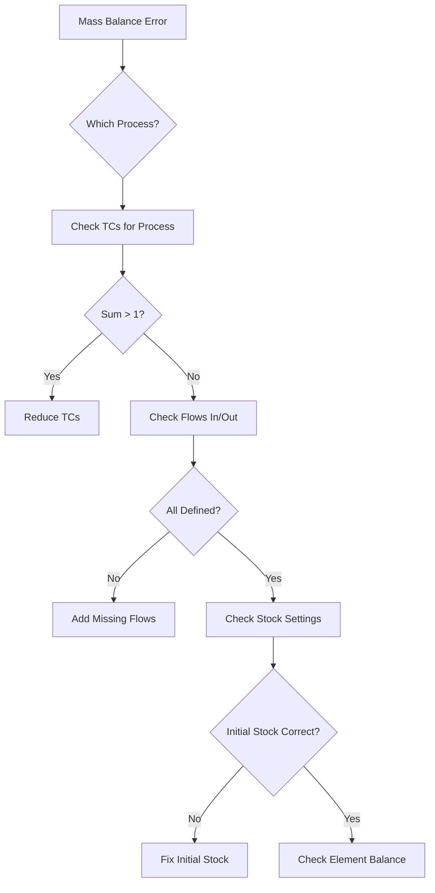

# BioDYM Troubleshooting Guide

This guide helps you diagnose and fix common issues when using BioDYM.

## Mass Balance Errors

Mass balance validation is the most critical check in any MFA. Here's how to diagnose and fix common issues.

### Understanding Mass Balance

For each process, this equation must hold:
```
Inputs + Initial Stock = Outputs + Final Stock
```

When BioDYM reports a mass balance error, it means this equation doesn't balance.

### Reading the Mass Balance Report

```
Mass Balance Check:
Process 0 (Environment): 0.00 ✓
Process 1 (Processing): -5.23 ✗
Process 2 (Storage): 0.00 ✓
Process 3 (End-of-Life): 2.61 ✗
```

- **Negative values**: Mass is disappearing (outputs > inputs)
- **Positive values**: Mass is being created (inputs > outputs)
- **Near-zero values** (< 1e-10): Computational rounding, ignore

### Common Mass Balance Issues

#### Issue 1: Transfer Coefficients Sum > 1

**Symptom**: Negative mass balance in a process

**Example**:
```
TC_01_02 = 0.7
TC_01_03 = 0.4
Sum = 1.1 (Error!)
```

**Solution**:
1. Check sheet `2_3_Process_TCs`
2. For each origin process, sum all TCs
3. Ensure sum ≤ 1.0
4. The remainder (1 - sum) becomes stock change

**Fix**:
```
TC_01_02 = 0.6
TC_01_03 = 0.3
Sum = 0.9 (OK, 0.1 goes to stock)
```

#### Issue 2: Missing Flow Definition

**Symptom**: Process shows large positive balance

**Cause**: Input flow exists in data but not in flow definitions

**Solution**:
1. Check `1_1_Definition_Flows` has all flows
2. Verify Process_ID_O and Process_ID_I are correct
3. Ensure Flow_ID matches between sheets

#### Issue 3: Stock Initialization Errors

**Symptom**: Year 1 has balance error, other years OK

**Cause**: Initial stock not properly defined

**Solution**:
1. If process has `Initial_Stock? = Yes`
2. Check `2_4_Process_Stock` has entry
3. Verify element percentages sum correctly

#### Issue 4: Dynamic TC Interpolation

**Symptom**: Balance errors in specific years

**Cause**: Dynamic TCs creating impossible values

**Solution**:
1. Check `2_5_dynamic_tcs` for the problem years
2. Ensure interpolated values stay in 0-1 range
3. Verify year values are within analysis period

### Mass Balance Debugging Workflow



## Excel Import Errors

### "File not found"

**Solutions**:
- Use absolute path: `/full/path/to/file.xlsx`
- Check file extension is `.xlsx` (not `.xls`)
- Ensure no special characters in path

### "Missing required sheet"

**Required sheets**:
1. `1_1_Definition_Flows`
2. `1_2_Data_Flows`
3. `2_1_Definition_Processes`
4. `2_3_Process_TCs`

**Solution**: Use template generator to create proper structure

### "Column not found"

**Common missing columns**:
- `Process_ID_O` (not Process_Origin)
- `TC_Value` (not Value)
- `Flow_Py` (not Flow_Value)

**Solution**: Check column names match exactly (case-sensitive)

## Calculation Errors

### "Division by zero"

**Cause**: Empty stock being divided

**Solution**:
- Check no process has TC = 1.0 for all outputs
- Ensure some material accumulates in stocks

### "Negative stock"

**Cause**: Outflow > stock available

**Solution**:
- Reduce transfer coefficients
- Increase initial stock
- Check DSM lifetime parameters

### "Memory error"

**Cause**: Too many Monte Carlo iterations

**Solution**:
- Reduce iterations (try 100 first)
- Limit time horizon
- Use fewer uncertainty parameters

## Visualization Issues

### Sankey Diagram Not Showing

**Causes**:
1. All flows are zero
2. Browser blocking JavaScript
3. Missing widget extension

**Solutions**:
```bash
# Enable Jupyter widgets
jupyter nbextension enable --py --sys-prefix widgetsnbextension

# Or use static plot
python src/main_cli.py --input data.xlsx --static-plots
```

### Plots Too Cluttered

**Solution**: Use flow threshold
```python
# In Jupyter
flow_threshold = 0.01  # Hide flows < 1% of total
```

## Performance Issues

### Slow Calculations

**For large systems**:
1. Disable Monte Carlo initially
2. Reduce time horizon for testing
3. Simplify system (merge similar processes)
4. Use CLI instead of Jupyter

### Out of Memory

**Solutions**:
1. Process one element at a time
2. Export results between runs
3. Use data aggregation
4. Increase system RAM

## Common Error Messages

| Error | Meaning | Fix |
|-------|---------|-----|
| "Process X not found" | Flow references undefined process | Add to Definition_Processes |
| "TC_X_Y not defined" | Missing transfer coefficient | Add to Process_TCs |
| "Year X out of range" | Data outside analysis period | Check time settings |
| "Invalid distribution" | Monte Carlo parameter error | Check distribution name |
| "Singular matrix" | Circular flow with no outlet | Add output flow |

## Data Validation Checklist

Before running analysis:

- [ ] All Process IDs sequential from 0
- [ ] All Flow IDs follow F_XX_YY format
- [ ] Transfer coefficients between 0 and 1
- [ ] TC sums ≤ 1.0 per process
- [ ] Years are integers
- [ ] Flow values are positive
- [ ] Element percentages sum to 1.0
- [ ] No duplicate IDs

## Getting More Help

### Enable Debug Mode

```bash
python src/main_cli.py --input data.xlsx --debug
```

This provides:
- Detailed error messages
- Intermediate calculation results
- Full stack traces

### Check Log Files

BioDYM creates logs in:
```
biodym_mfa_tool/logs/biodym_YYYYMMDD_HHMMSS.log
```

### Create Minimal Example

If still stuck:
1. Simplify to 2-3 processes
2. Use single year
3. Remove DSM/FOMP
4. Test basic flow

### Community Support

- Check existing [GitHub Issues](https://github.com/yourusername/Biodym_JS/issues)
- Post minimal reproducible example
- Include error messages and logs
- Share Excel file (remove sensitive data)

## Prevention Tips

1. **Start Simple**: Test with basic system first
2. **Incremental Changes**: Add complexity gradually
3. **Version Control**: Save working versions
4. **Document Assumptions**: Note in metadata
5. **Regular Validation**: Check mass balance often
6. **Use Templates**: Don't create from scratch

---

Remember: Mass balance errors are usually caused by transfer coefficients. Check those first!