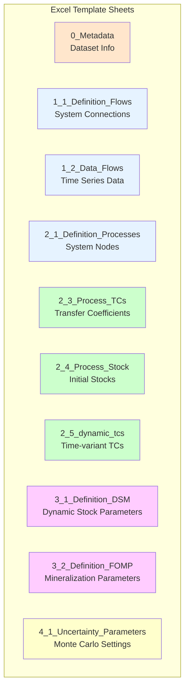
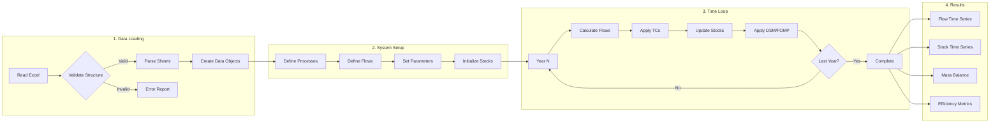
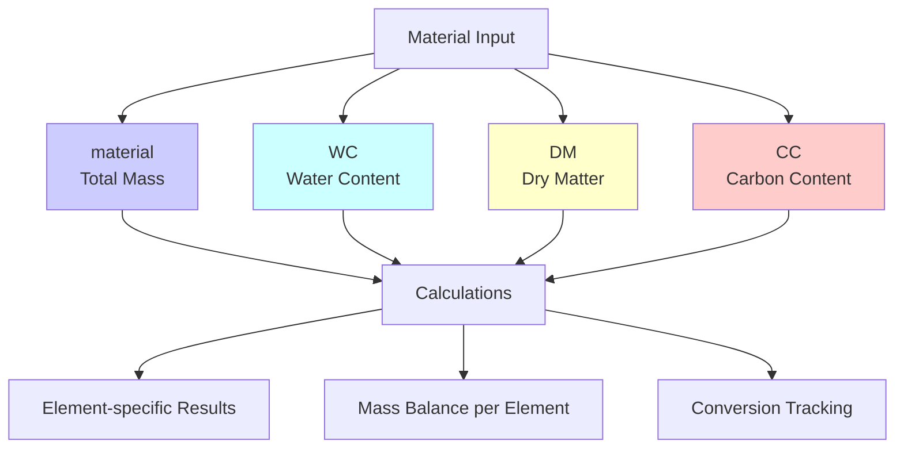
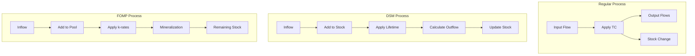
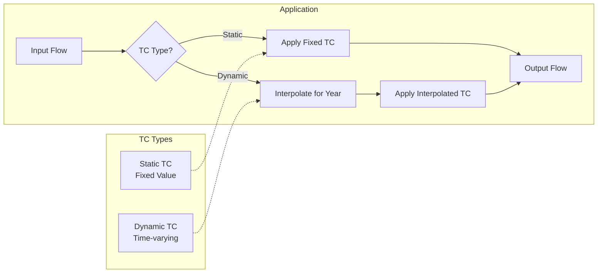
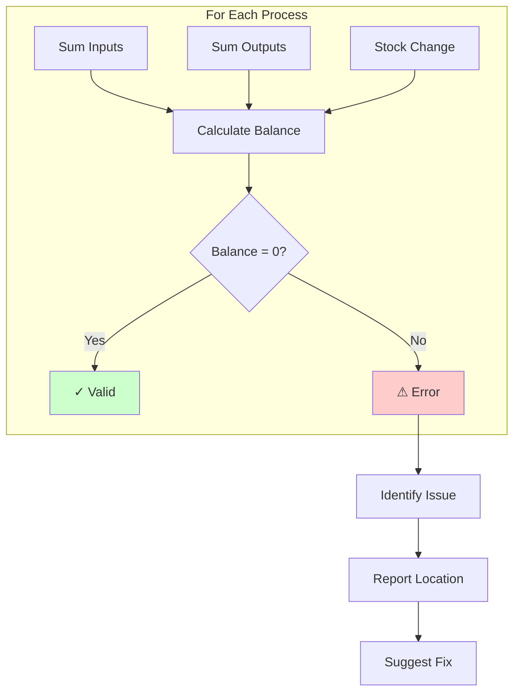
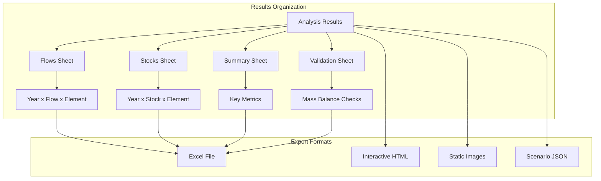
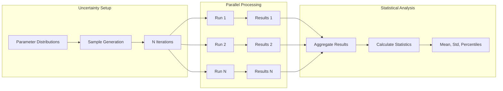

# BioDYM Data Flow Documentation

This document explains how data flows through the BioDYM system, from Excel input to final results.

## Excel Input Structure

## Data Processing Pipeline

## Material Elements Tracking

BioDYM tracks four material elements through the system:

## Process Types and Calculations

## Transfer Coefficient Application

## Mass Balance Validation

## Data Export Structure

## Monte Carlo Data Flow

