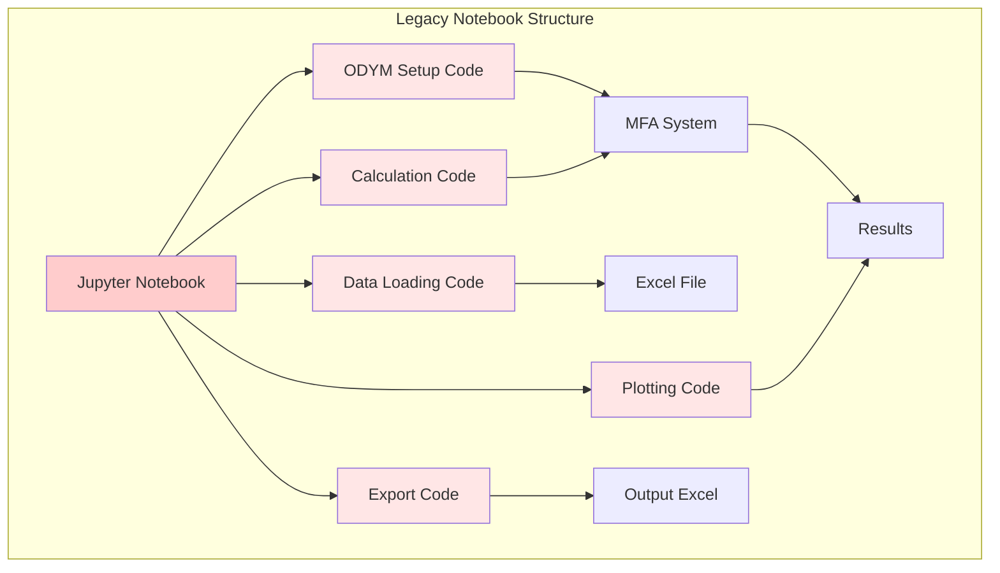
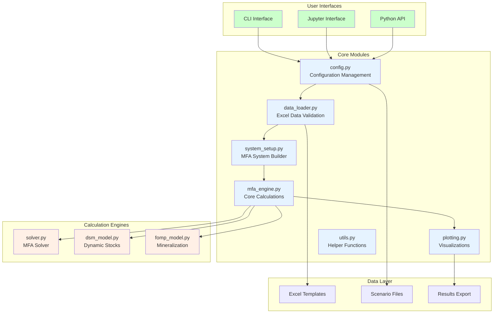
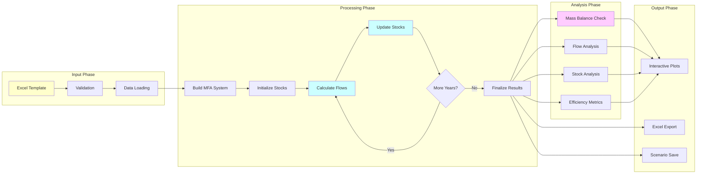
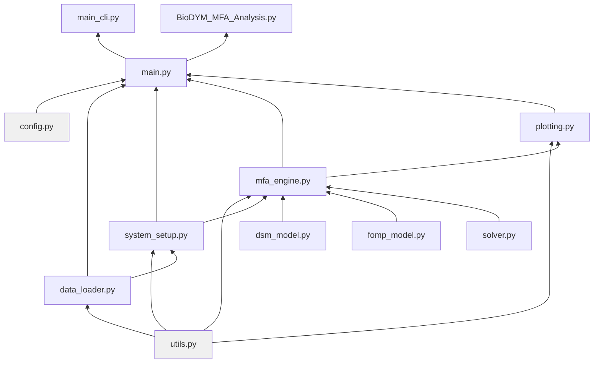

# BioDYM System Architecture

This document illustrates the evolution of BioDYM from a notebook-based tool to a modular application.

## Legacy Architecture (Notebook-based)

The original BioDYM implementation used monolithic Jupyter notebooks with all functionality embedded in single files.

### Characteristics:
- All code in single `.ipynb` file
- Manual copy-paste for new analyses
- Direct ODYM framework calls
- Limited error handling
- No code reuse between notebooks

## Modern Architecture (Modular Tool)

The new BioDYM tool separates concerns into specialized modules with clear interfaces.

### Key Improvements:
- **Separation of Concerns**: Each module has a single responsibility
- **Multiple Interfaces**: CLI, Jupyter, and programmatic access
- **Configuration Management**: Centralized settings and validation
- **Error Handling**: Comprehensive validation at each step
- **Testability**: Unit tests for each module
- **Reusability**: Shared code across all interfaces

## Data Flow Architecture

## Module Dependencies

## Technology Stack

### Core Technologies
- **Python 3.8+**: Main programming language
- **NumPy**: Numerical computations
- **Pandas**: Data manipulation
- **ODYM**: MFA framework foundation
- **Plotly**: Interactive visualizations

### Development Tools
- **pytest**: Testing framework
- **openpyxl**: Excel file handling
- **scipy**: Statistical distributions
- **matplotlib**: Additional plotting

### User Interfaces
- **Jupyter**: Interactive analysis
- **argparse**: Command-line interface
- **ipywidgets**: Interactive controls