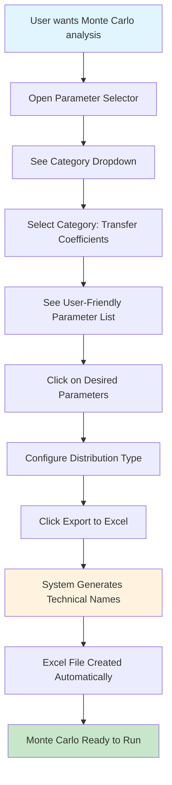

# Monte Carlo Parameter Selection - User Interaction Flow

## 🎯 **The Problem We Solved**

**Before:** Users had to manually type complex parameter names in Excel
**After:** Users select parameters by meaning using a visual interface

---

## 📊 **User Interaction Flow**



---

## 🖥️ **Step-by-Step User Experience**

### **Step 1: User Opens Interface**
```
🎲 MONTE CARLO PARAMETER SELECTOR
─────────────────────────────────────
```

### **Step 2: User Sees Categories**
```
📋 Parameter Category: [Transfer Coefficients ▼]
   • Transfer Coefficients
   • Dynamic Stock Model  
   • First-Order Mineralization Process
   • Initial Stocks
   • Stock-Outflow Transfer Coefficients
```

### **Step 3: User Selects Category**
```
📝 Available Parameters:
   ☐ Transfer Coefficient: Harvest → Processing (TC_00_01)
   ☐ Transfer Coefficient: Processing → Storage (TC_01_02)
   ☐ Transfer Coefficient: Storage → Distribution (TC_02_03)
   ☐ Transfer Coefficient: Distribution → Use (TC_03_04)
```

### **Step 4: User Clicks Parameters**
```
✅ Selected Parameters:
   • Transfer Coefficient: Harvest → Processing
   • Transfer Coefficient: Processing → Storage
```

### **Step 5: System Generates Excel**
```
📊 Generated Excel Format:
   Parameter_Name | Distribution | Mean | StdDev
   TC_00_01      | normal       | 0.8  | 0.08
   TC_01_02      | normal       | 0.9  | 0.09
```

---

## 🔄 **Before vs After Comparison**

### **❌ BEFORE (Complex)**
```excel
User manually types in Excel:
Parameter_Name | Distribution | Mean | StdDev
dsm_6_lifetimes_Mean_0 | normal | 10 | 1
fomp_8_k1 | normal | 0.05 | 0.005
TC_03_04 | normal | 0.6 | 0.06
```

**Problems:**
- ❌ Had to memorize complex names
- ❌ Easy to make typos
- ❌ Not intuitive
- ❌ Different naming patterns

### **✅ AFTER (User-Friendly)**
```python
User selects from interface:
1. Category: "Dynamic Stock Model"
2. Parameters: 
   ☐ DSM Process 6 - Short-lived - Mean Lifetime
   ☐ DSM Process 6 - Long-lived - Mean Lifetime
3. System generates: dsm_6_lifetimes_Mean_0
```

**Benefits:**
- ✅ No need to memorize names
- ✅ Intuitive selection by meaning
- ✅ Reduced errors and typos
- ✅ Faster parameter setup

---

## ⚡ **Quick Setup Option**

For users who want even simpler setup:

```python
# User says: "I want uncertainty in transfer coefficients and DSM"
quick_params = quick_mc_setup(
    common_params=['Transfer Coefficients', 'Dynamic Stock Model']
)

# System automatically selects common parameters:
# • TC_00_01: normal distribution
# • TC_01_02: normal distribution  
# • dsm_6_lifetimes_Mean_0: normal distribution
# • dsm_6_lifetimes_Mean_1: normal distribution
```

---

## 🎯 **Key Benefits**

| Aspect | Before | After |
|--------|--------|-------|
| **Parameter Names** | Complex technical names | User-friendly descriptions |
| **Selection Method** | Manual typing in Excel | Visual selection interface |
| **Error Rate** | High (typos common) | Low (validation built-in) |
| **Learning Curve** | Steep (memorize names) | Gentle (intuitive categories) |
| **Setup Time** | Slow (manual entry) | Fast (click and select) |

---

## 🚀 **Implementation Status**

- ✅ **Core codelist system** - `MCParameterCodelist` class
- ✅ **User interface** - `MCParameterSelector` class  
- ✅ **Quick setup function** - `quick_mc_setup` function
- ✅ **Excel export** - Automatic format generation
- ✅ **Documentation** - Complete user guide
- ✅ **Integration** - Added to scientific notebook

**Ready for use!** Users can now select Monte Carlo parameters by meaning instead of having to know complex technical names. 