# BioDYM Workflow Overview

This document describes the complete workflow for using BioDYM, from data preparation to results analysis.

## High-Level Workflow

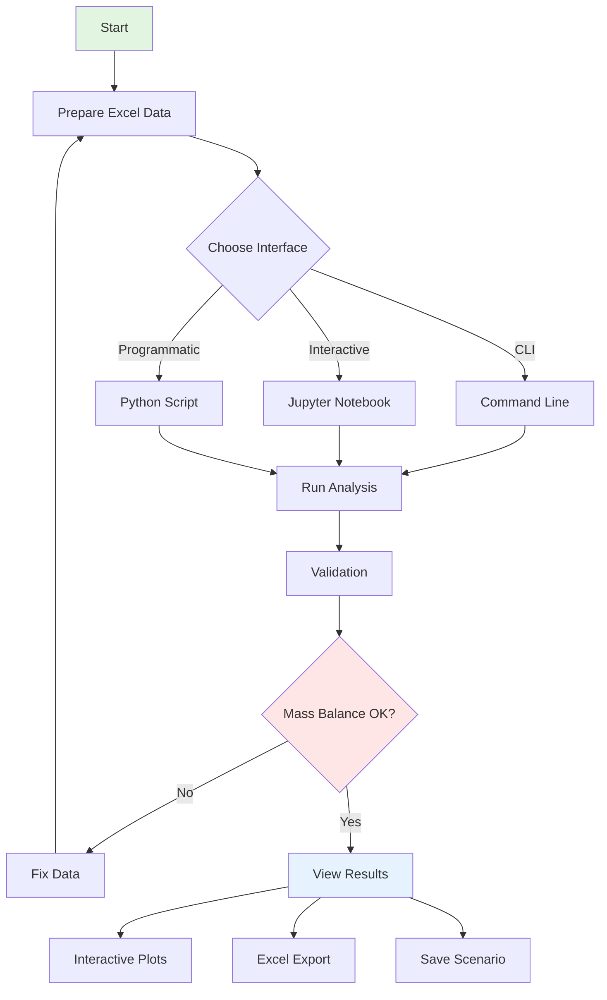

## Detailed Workflow Steps

### 1. Data Preparation Phase

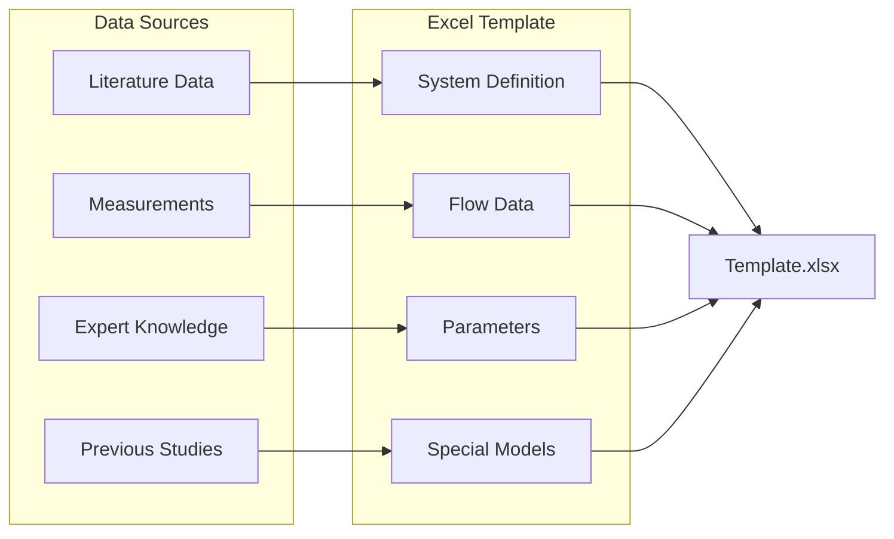

### 2. System Definition Phase

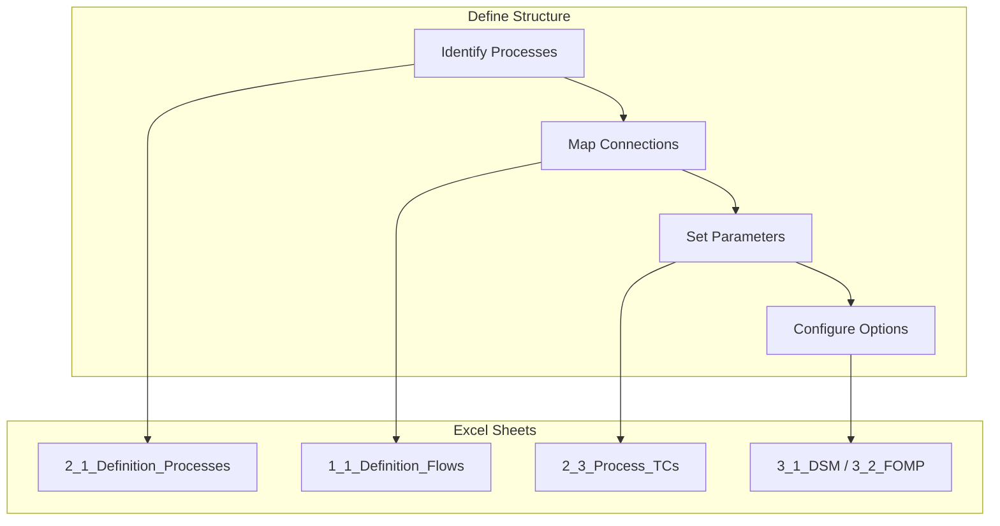

### 3. Analysis Execution Phase

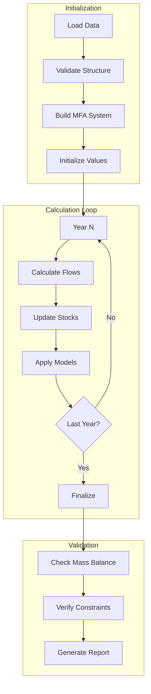

### 4. Results Analysis Phase

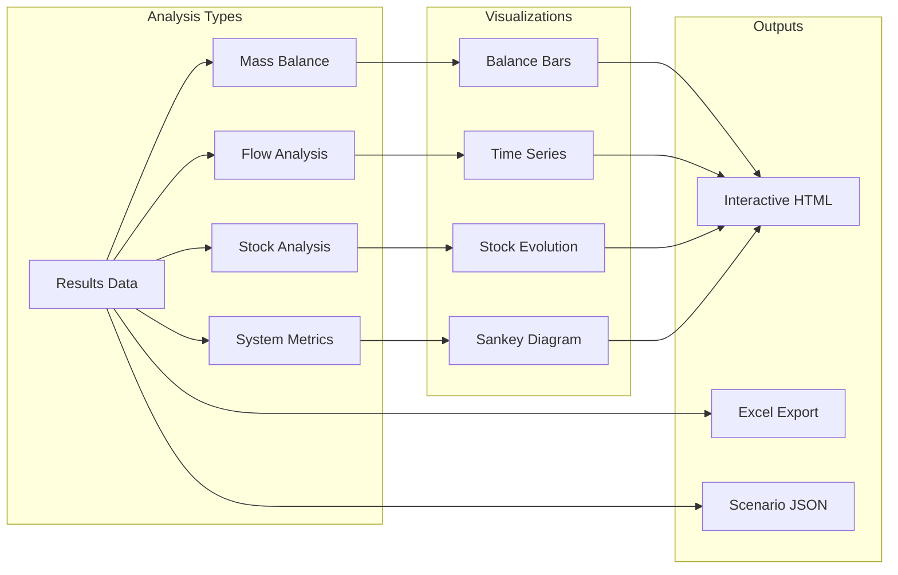

## Interface-Specific Workflows

### CLI Workflow

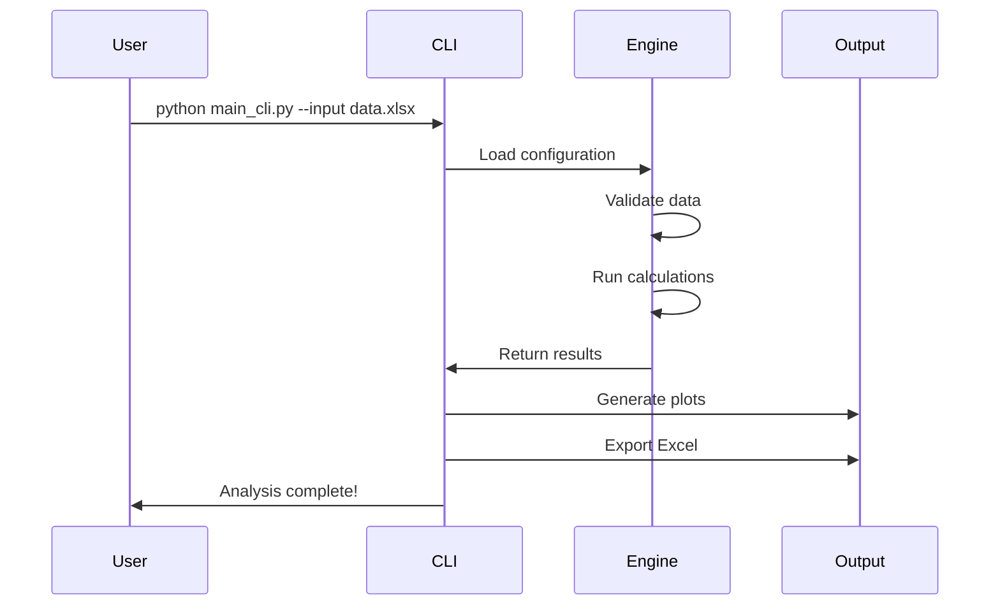

### Jupyter Workflow

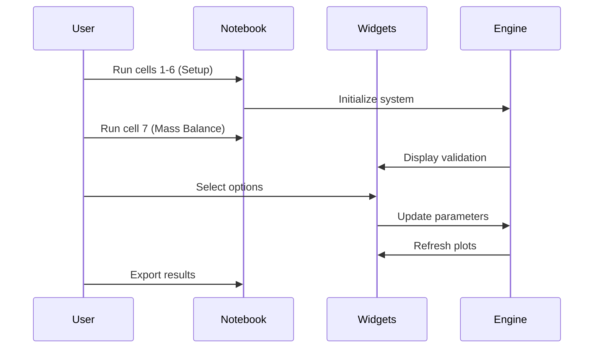

## Decision Points

### Choosing Analysis Type

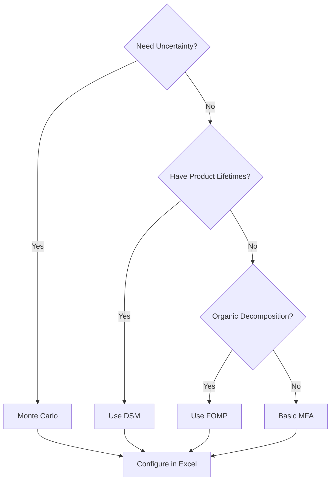

### Troubleshooting Workflow

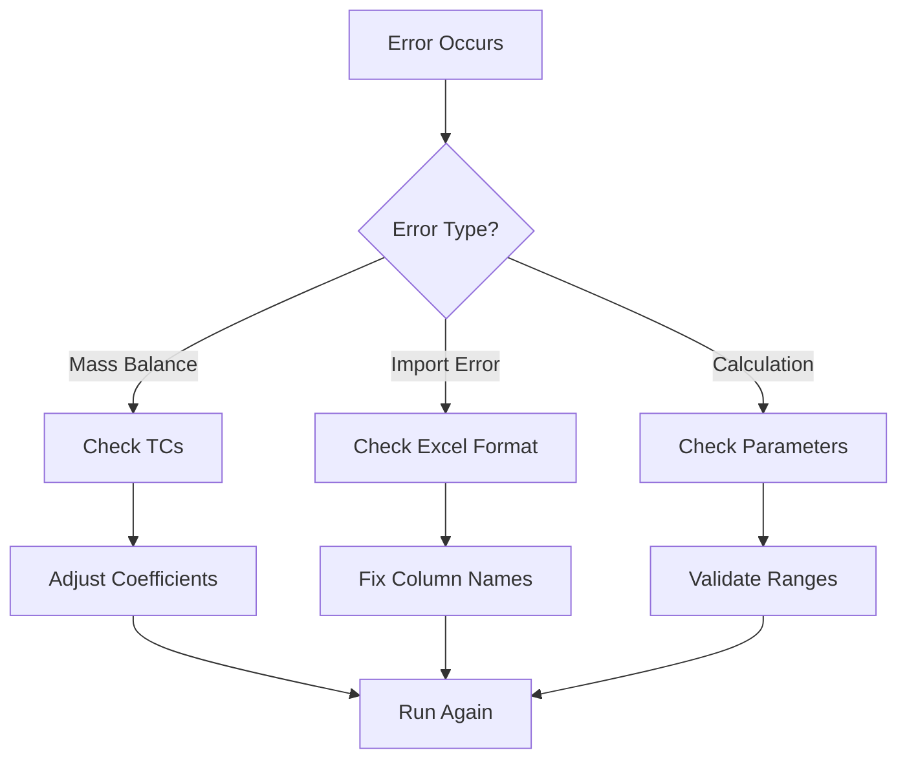

## Best Practices Workflow

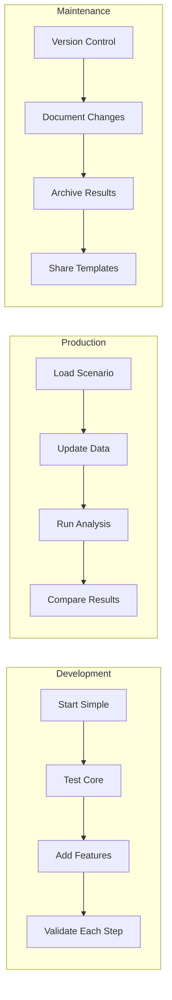

## Scenario Management Workflow

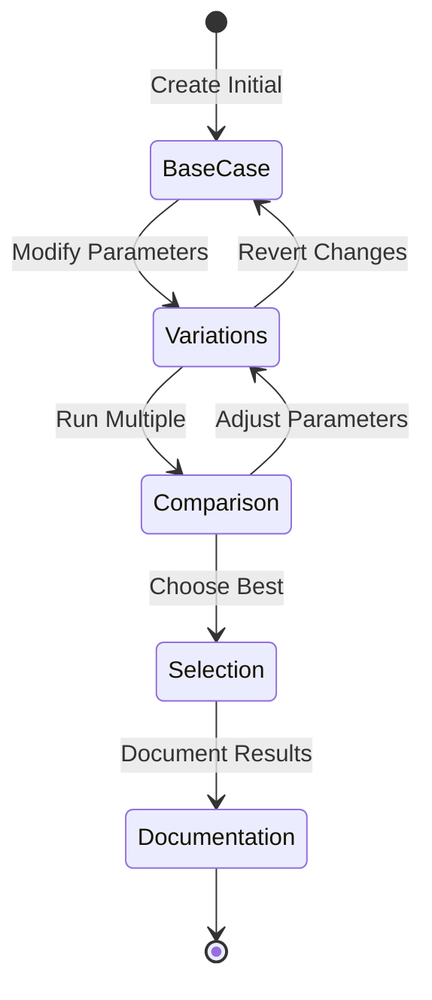

## Integration Workflow

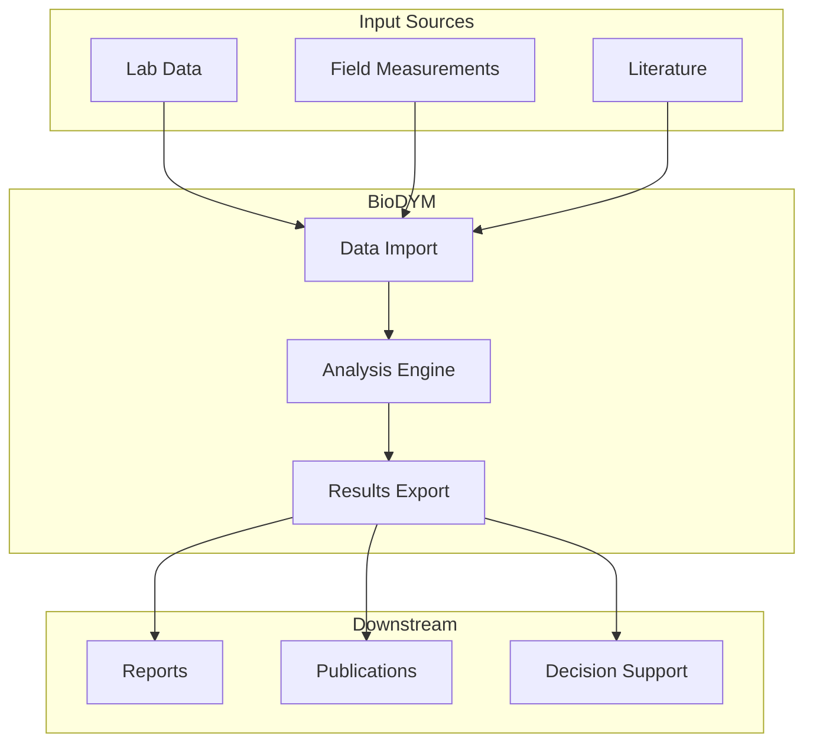

## Recommended Workflow Sequence

1. **Planning Phase**
   - Define system boundaries
   - Identify data sources
   - Sketch process flow

2. **Setup Phase**
   - Create Excel template
   - Input base data
   - Define parameters

3. **Testing Phase**
   - Run with few years
   - Check mass balance
   - Validate results

4. **Analysis Phase**
   - Full time horizon
   - Sensitivity analysis
   - Scenario comparison

5. **Reporting Phase**
   - Export results
   - Create visualizations
   - Document findings

## Quick Reference

### Daily Workflow
```bash
# Morning: Load yesterday's work
python src/main_cli.py --input current_work.xlsx --scenario yesterday

# Work: Test new parameters
python src/main_cli.py --input test_params.xlsx --validate-only

# Afternoon: Run full analysis
python src/main_cli.py --input final_params.xlsx --monte-carlo

# Evening: Save progress
python src/main_cli.py --save-scenario today
```

### Weekly Workflow
- Monday: Data collection and cleaning
- Tuesday: System setup and validation
- Wednesday: Run base scenarios
- Thursday: Sensitivity analysis
- Friday: Results compilation and reporting

---

For detailed instructions on any workflow step, see:
- [Quick Start Tutorial](QUICKSTART.md)
- [Excel Template Guide](EXCEL_TEMPLATE_GUIDE.md)
- [Troubleshooting](TROUBLESHOOTING.md)